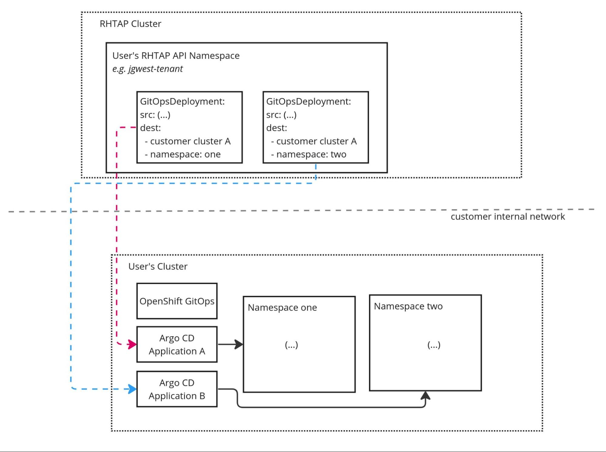
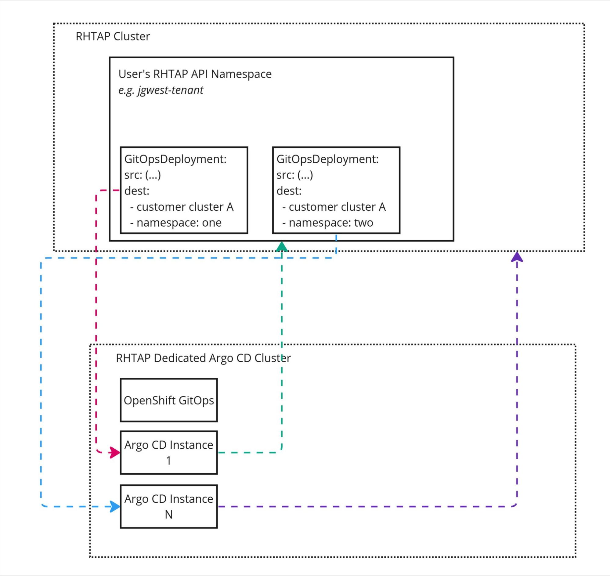
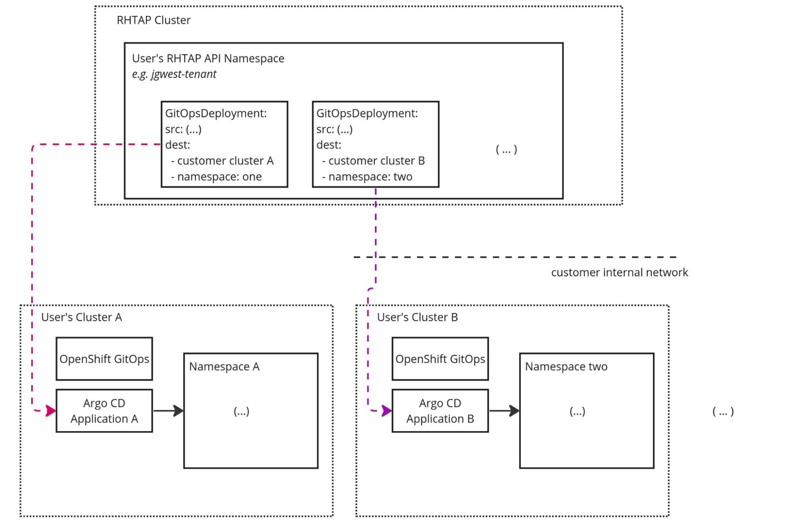

# Advanced Use Cases not covered by 'Application in any Namespace' GitOps Service Model

### Written by
- Jonathan West (@jgwest)
- Originally written August 31st, 2023

The 'Application in any namespace' Argo CD model for GitOps Service presumes that Argo CD will always be on the same cluster as user GitOpsDeployment/ManagedEnvironment/RepositoryCredential.

This is not true in all cases, and this assumption prevents us from supporting a number of important,  advanced use cases.

# Advanced Use Cases not covered by 'everything managed by Argo CD' model

## A) No obvious mechanism for us to support deploying to customer clusters that are behind customer firewall, or to support Argo CD "pull model"

* If a customer has an Argo CD instance running behind their firewall, and they wish to manage this Argo CD instance using RHTAP, our current GitOps Service architecture supports this.  
* They just need to run cluster-agent on that cluster.  This is described [here](../proposal-gitops-service-pull-model-using-cluster-agent-component).  
* Or, if they wish to use the Argo CD pull model to manage their cluster, the current architecture will support this.  
* Using ACM for this case has been proposed, but there is no obvious way to make ACM work with the current proposal. (And I would want to see a POC of ACM working as we expect before we go down this route. It seems too heavy for our needs).

This use case looks like this:

## B) Security: No way for us separate Argo CD from member cluster (where users workloads run)

* At present, untrusted user workloads are run on the same cluster as Argo CD, which makes it easier for users to able to compromise the Argo CD instance.  
* With our current GitOps Service architecture, it's straightforward to move Argo CD off the RHTAP member cluster and on to a separate cluster.  
* If we were to follow the architectural model proposed, we could not do this.

This use case looks like this:  

## C) A single pane of glass to manage/deploy from Argo CD instances wherever they are

* Ability to define GitOpsDeployments/ManagedEnv/etc on RHTAP member cluster, and have those deploy from any Argo CD instance (no matter where that Argo CD instance lives)

This use case looks like this:  

## D) Support for infinite scalability: Ability to scale Argo CD instances beyond a single cluster

* We may discover a point where a user has so many GitOpsDeployments that they overwhelm the ability to deploy them all from a single cluster.  
* Likewise, multiple Argo CD instances on a cluster cannot own the same Namespace. What if a single user creates enough GitOpsDeployments in their Namespace to overwhelm a single Argo CD instance?  
* In this case, with our current architecture, we have architectural support for deploying GitOpsDeployments across multiple Argo CD instances that can be spread across multiple clusters.  
* In contrast, with the 'Application in any namespace' Argo CD model, there is no way to have multiple Argo CD instances spread across different clusters to handle heavy users.

## E) Dedicated instances
