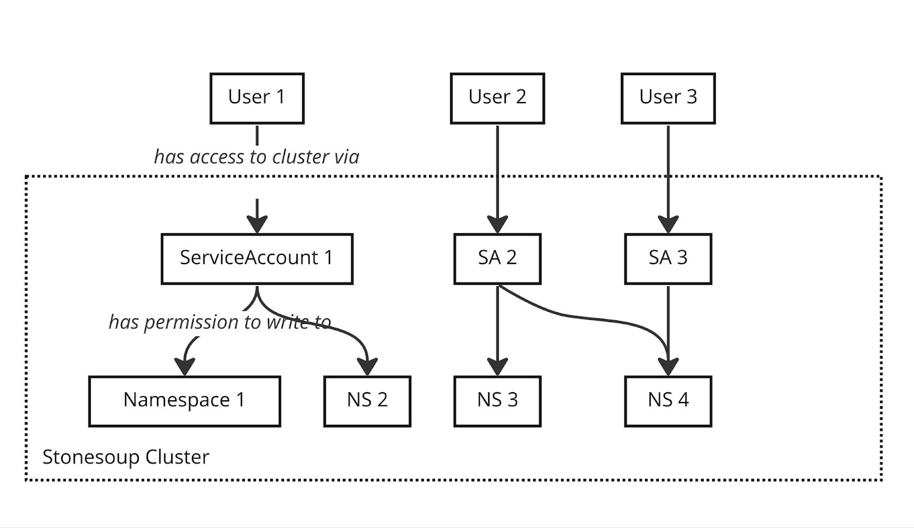
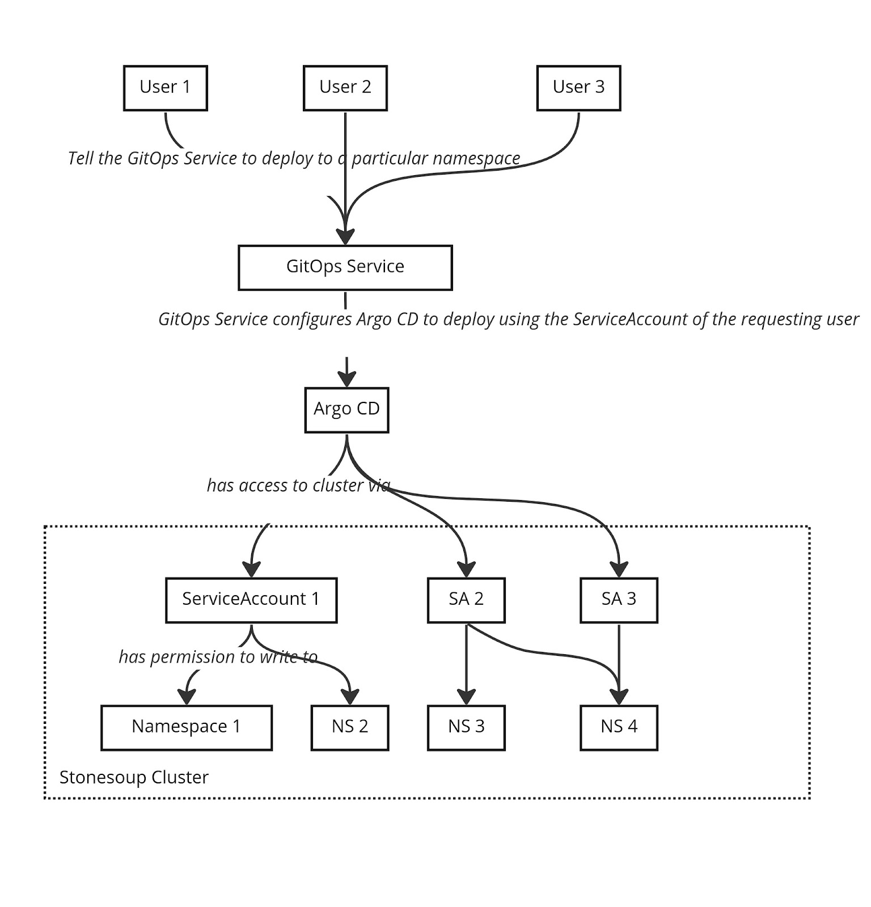

# Argo CD/GitOps Service support for multiple service accounts on a single cluster

### Written by
- Jonathan West (@jgwest)
- Originally written January 4th, 2023

## Introduction 

In Stonesoup, we plan to give users their own namespaces on a cluster. The API CRs of the various Stonesoup services, for that particular user, will then be created inside the user's namespace.

For example, as a user of Stonesoup, I might have a namespace 'jonwest' (based on my RH SSO username), and in that namespace will be Application CRs, Component CRs, Environment CRs, and so on. Those CRs would be used for the application development and deployment I wish to do from that namespace.

However, we (Stonesoup) would like users to be able to deploy (using GitOps Service/Argo CD) to multiple Namespaces of a cluster, with that cluster either being the same cluster as the API namespace, or a different cluster.

(The cluster containing the API CRs, and the deployment cluster, are presumed to be the same here, for illustrative purposes.).

For example, on a single cluster, a user ‘jonwest’ would have access to:

- A 'jonwest-dev' namespace for development environment

- A 'jonwest-staging' namespace for staging environment, for pre-production testing

- A 'jonwest-production' namespace for production

This requires a one-to-many relationship between users and namespaces: A user has access to multiple namespaces on a cluster, and should likewise be able to use the GitOps Service (and, indirectly, Argo CD) to deploy to those namespaces.



The current proposed solution for controlling user access is known as SpaceRequests, and is based on _ServiceAccounts_. This works with the [Environment Provisioning functionality](https://github.com/redhat-appstudio/book/blob/main/ADR/0008-environment-provisioning.md).


# SpaceRequests and Environments

In this model (I’m paraphrasing), a ServiceAccount will exist that is configured with the specific permissions that a user has access to on a given cluster.

So if a user has access to namespaces jonwest-dev, jonwest-staging, and jonwest-production, then a ServiceAccount+Role+RoleBindings will exist that allows the user to create resources in these namespaces using that ServiceAccount.

We would like to (re)use those same ServiceAccounts with the GitOps Service, and Argo CD, to deploy to clusters.




However, the problem is that Argo CD cannot deploy to the same cluster (URL) via multiple cluster secrets. If multiple Argo CD cluster secrets exists for a single cluster, Argo CD will not properly handle them (in fact, it will arbitrarily switch between them: if you watch in the UI, you will see the value swap back and forth wildly.)

- <https://github.com/argoproj/argo-cd/pull/10897>

- <https://github.com/argoproj/argo-cd/issues/2288>

- <https://github.com/argoproj/argo-cd/issues/4928>

- <https://github.com/argoproj/argo-cd/issues/5275>

- <https://github.com/argoproj/argo-cd/issues/9515>

So the question is: is it possible for us to still use these per-user ServiceAccounts to deploy with Argo CD?

Note: In the diagram I have all the namespaces on the same cluster, but one the namespaces may also be on other clusters.


# Possible Solutions

## Options that preserve the use of per-user ServiceAccounts

_These options preserve the use of per-user ServiceAccounts._


### Option A: GITOPSRVCE-240 - Decouple control plane and application sync privileges

Potentially, an impersonation-style feature like [GITOPSRVCE-240](https://issues.redhat.com/browse/GITOPSRVCE-240) could be used to allow Argo CD to support multiple users on a single cluster. This appears to be an oft-requested feature, but the devil is in the details.

**Advantages:**

- If designed as needed, we would be able to configure Argo CD to use the ServiceAccounts from SpaceRequest API.

**Disadvantages:**

- Not currently implemented, might not fit within the timeframe we need.

- Requires upstream agreement on specific solution


### Option B: An Argo CD instance per user

Giving each user their own full Argo CD instance, and configuring it based on the permissions they have, should allow us to avoid this issue. 

**Advantages:**

- Since a user is only ever going to have a single set of permissions on a particular cluster, if we give each user their Argo CD, this problem is resolved.

- Doesn’t not require an upstream feature to be implemented, and shipped in GitOps Service

- The math on the number of pods supported on K8s appears to work out, see Jann’s doc for details.

**Disadvantages:**

- We currently don't have support for creating/maintaining an Argo CD instance per user.

- This is also a potentially large number of Argo CD instances that we would need to manage. For example, the DevSandbox product currently has 3000ish users. If we had a similar number of users for this service, that would be 3000 Argo CD instances to manage.

- We may need to also make changes to the OpenShift GitOps Operator to allow it to scale to handling a large number of ArgoCD operands

- As a corollary, we lose the advantages of sharing Argo CD instances between users (memory efficiency)


### Option C1: Some kind of HTTP proxy that "fakes" a cluster URL for a particular user/service account

For example, Argo CD may treat these two clusters as different, even if they both redirect/reverse proxy to the same actual cluster:

-  https\://actual-cluster-url?user=jonwest

-  https\://actual-cluster-url?user=wtam

For example, https\://actual-cluster-url?param=(user) would reverse proxy to https\://actual-cluster-url (an actual k8s cluster), but from the perspective of Argo CD it might see each URL as different due to the ?param= part of the URL.

I don't actually know if this would even work, I'm just brainstorming here.

Another example of this would be a DNS rule with https\://\*.cluster-api-url.com which would resolve to https\://cluster-api-url.com for all '\*' values. You could then put users in the subhost field, e.g. https\://jonwest.cluster-api-url.com, and Argo CD could potentially treat them as separate clusters.

**Advantages:**

- Might not require upstream feature

  - Go to community meeting and “take the temperature” of the idea, see how folks feel about this behaviour

  - Jann mentions that other folks in the wild are already using this as a pattern

**Disadvantages:**

- Hacky, or at least approaching hacky, depending on solution

- In order to reduce the “hackiness”, we would need to add upstream unit/E2E tests to Argo CD, to prevent others from regressing this desired behaviour.

- Not necessarily portable between different K8s cluster network/router configurations


### Option C2: Add Query Parameter URL to Argo CD URLs

This is very similar to Option C1, except that no MITM proxy or DNS is used. Instead, we merely add a query parameter to cluster URLs in Argo CD Secrets.

For example, Argo CD will treat these two clusters as different, even if they both share the same base URL:

- Scoped by username

  - _https\://actual-cluster-url?user=jonwest_

  - _https\://actual-cluster-url?user=wtam_

- Scoped by managed environment uid

  - _https\://actual-cluster-url?managedEnvironment=(uuid of managed env in jonwest namespace)_

  - _https\://actual-cluster-url?user=(uuid of managed end in wtam namespace)_

To be clear: we are adding an arbitrary new field which is not supported by K8s.

This is my proposed solution. See ‘Jonathan’s Proposed Solution’ below for details on this.


**Advantages:**

- Jann spoke with the Argo CD community to take the temperature of adding support for this feature

  - He notes: I took the "query parameters to cluster URLs to make them unique" use case to today's contributors meeting, and it's general consensus that we want to support this.

  - Likewise Jann and [Jonathan](https://github.com/redhat-appstudio/managed-gitops/compare/main...jgwest:managed-gitops:argocd-behaviour-test-feb-2023?expand=1) tested it, and it works

- Jann also mentioned previously that other folks in the wild are already using this as a pattern

- Likely does not require an upstream feature proposal

  - We can instead implement upstream unit/E2E tests to ensure Argo CD does not regress this behaviour.

**Disadvantages:**

- We are relying on Kubernetes API cluster URL behaviour for which we do not know how stable it is.

  - For example, what happens if K8s API server decides that arbitrary queryParameters on cluster URLs should be rejected?

  - Or, what if we encounter a proxy between the cluster, and us, which doesn’t like the query parameters?

- Argo CD may change the behaviour on us, but contributing unit/E2E tests (as described above) should successfully mitigate this.


## Options that abandon the use of per-user ServiceAccounts

_These options preserve the use of per-user ServiceAccounts, which may substantially affect the feasibility of Space Request/Environment proposals._


### Option D: Give Argo CD full access to every cluster, and use AppProjects to maintain user boundaries in Argo CD

For this option, we abandon the user of ServiceAccounts for each user. 

We would instead need to find some way to translate SpaceRequests -> AppProjects, and add AppProject-style support to GitOps Service. The feasibility of this is unknown.


# Jonathan’s Proposal

## Short term solution - Implement option C2: Add Query Parameter URL to Argo CD URLs in the GitOps Service

We need a solution for this that will allow us to meet our service preview goals. STONE-114 is a blocker for Service Preview, and is thus essential.

I thus propose we implement option C2, as above. 

The only challenge here is that it relies on the behaviour of Kubernetes and Argo CD API URL behaviour, in order to ensure correctness. 

- We can mitigate that by contributing unit/E2E tests to Argo CD, and GitOps Service, to ensure this behaviour is not regressed. 

- We should also pursue a longer term solution, see below.

In the GitOps Service itself, the fix is straightforward: When creating a new Argo CD cluster secret, we would append the UID of the managed environment, like so:


```yaml
kind: Secret
metadata:
  name: managed-env-(uid of managed environment row)
  namespace: gitops-service-argocd
  labels:
    argocd.argoproj.io/secret-type: cluster
    databaseID: (uid of managed environment row)
data:
  name: managed-env-(uid of managed environment row)

  server: "http://(cluster url provided by user)?managedEnv=(uid of managed environment row)" # <=== this field has the new behaviour: query parameter is new

  config: "( json config data)"
```

In the above example, the new behaviour is the ‘?managedEnv=’ query parameter on the .data.server field.

This should ensure that Argo CD treats each user’s ‘slice’ of the cluster as a separate cluster.

Presuming we are fine with this solution, the following stories will be added to the epic, for implementation:

- A) Contribute unit/E2E tests upstream to Argo CD/gitops-engine repos, to verify/prevent regressions of the desired cluster API behaviour

- B) Contribute unit/E2E tests to GitOps Service, to verify/prevent regressions of the desired cluster API behaviour

- C) Implement logic in cluster-agent component of GitOps Service to add the above managedEnv field to Argo CD cluster secrets


## Medium/long term solution: Open an epic to decide on either more Argo CD native solution (e.g. impersonation), or GitOps Service native solution (per user Argo CD instances)

PMs, Architects, Stakeholders et al to determine what is a good permanent solution: one that does not depend on Kubernetes API URL parsing behaviour, but rather on either a proper Argo CD feature (e.g. impersonation), a GitOps Service feature (a dedicated Argo CD instance per API namespace), or some combination.

Examples of a potential solution that would be implemented by this epic would include **Option A**, and **Option B**, above. 

- Speaking personally, from a technical perspective, I’m happy with either.

- They both have advantages and tradeoffs that should be balanced based on business needs, scalability, and upstream interests.

This epic would be opened to track determining and implementing that more permanent solution. PMs to prioritize implementation priority.
