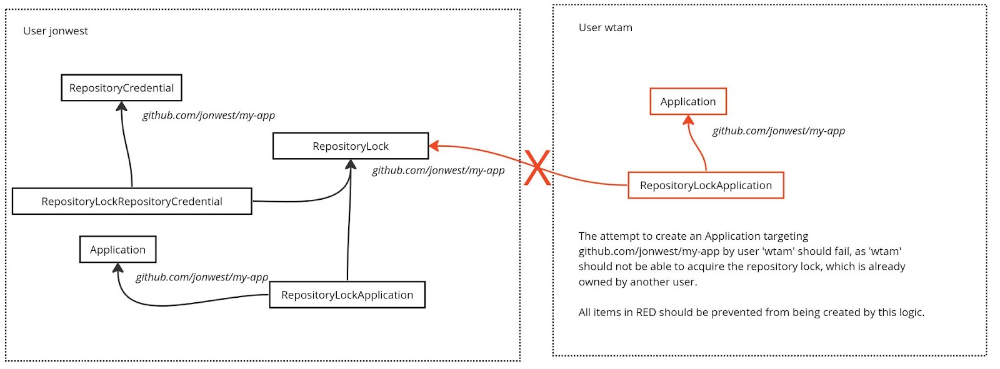

# Ensuring GitOps Repository URL Uniqueness

### Written by
- Jonathan West (@jgwest)
- Originally written April 25th, 2023

**TL; DR**: Before creating a new Application or RepositoryCredential row that references a Git repository, we ensure there doesn't exist another user that is already referencing that Git repository.

- How?

- We create a new database table, **RepositoryLockOwner**, that contains the specific Git repositories that are owned by each user

  - We rely on a uniqueness constraint on the repository url field to enforce that

  - This ensures global, inter-user uniqueness and atomicity (preventing race conditions)

- We return an error if a user attempts to create a RepositoryCredential or Application that targets a repo URL for which they do not own the corresponding URL in the RepositoryLockOwner row

- We also create new database tables, **RepositoryLockApplication** and **RepositoryLockRepositoryCredential**, to maintain references to that RepositoryLockOwner, so that we can GC the lock once it's no longer referenced.

  - This is basically GC via reference counting

# Implementation Details

## New Database Tables

**RepositoryLockOwner** (or better name)

- _Description_: Maintains a unique list of which user owns which repository credential url. The uniqueness is guaranteed by a uniqueness constraint on the gitRepositoryURL field.

- Fields:

  - **id** string (primary key, unique, generated on creation of RepositoryLockOwner)

  - **gitrepositoryURL** string (unique, non-null)

    - normalized: should be the same whether the repo url is SSH or GIT, etc.

    - See Argo Cd for code that will normalize a Git repository URL (but, double check that their definition of normalization is the same as what we need)

  - **clusteruser** string (foreign key to clusteruser table, non-null)

(**NOTE**: this table and its behaviour is basically very similar to another table, AppProjectRepository. For our purposes here, I'll keep them separate.)

**RepositoryLockApplication**

- _Description_: Maintain a list of which Applications reference which Git repository locks. This allows us to clean up RepositoryLockOwners, if there are no longer any applications/repositorycredentials that reference that lock.

- Fields:

  - **lockID** string (foreign key to id field of RepositoryLockOwner, non-null)

  - **applicationID** string (foreign key to application\_id field of Application, non-null)

**RepositoryLockRepositoryCredential**

- _Description_: Maintain a list of which Repository Credentials that reference which Git repository locks. This allows us to clean up RepositoryLockOwners, if there are no longer any applications/repositorycredentials that reference that lock.

- Fields:

  - **lockID** string (foreign key to id field of RepositoryLockOwner, non-null)

  - **repositorycredentialID** string (foreign key to repositorycredentials\_id field of Repository Credential, non-null)

## New functions and behaviour

Create a new function **AcquireRepositoryCredentialURL(acquiringUser string, normalizedRepoURL string) (string, bool, string, error)**, with pseudocode:

- _Description: Acquire a repository lock on a particular Git repository, for a particular user_

- **return values**: 

  - The primary key of the repository lock owner

  - whether the user acquired the URL

  - if the bool is false then the name of the other user that owns the repo url

  - generic error return

- **Steps:**

  - Sanity check that the user param is non-empty

  - Sanity check the normalized repo url param is normalized (if possible)

* SELECT id, clusterUser on the RepositoryLockOwner database table,  WHERE gitRepositoryURL=normalizedGitRepoURL field

  - We should ensure we index on this field

* If a match in the table already exists:

  - return false, "a repository URL is already claimed by another user: "+clusterUser, nil

* Else:

  - INSERT the acquiring user and normalizedRepo URL into the database

    - On success, \`return id, true, "", nil\`

    - On fail, due to failing uniqueness constraint: \`return “”, false, "a repository URL is already claimed by another user: "+clusterUser", nil\`

    - This failure occur to the very rare chance that another user inserted between our SELECT and our INSERT calls.

    - On other error, return \`””, false, "", err\`

     

When we are about to create or modify an Application, or a repository credential, call the above function to ensure we own the lock on it. If we don't own the lock on it, return an error, and don't allow the creation/modification of that application/repositorycredential.

**Next, whenever an Application or RepositoryCredential row is about to be created/modified, we should first do this:**

- Call AcquireRepositoryCredentialURL on the URL

  - If it fails, report that back as an error, and exit.

  - Don’t allow the Application/RepositoryCredential to be create/modifeid.

- For application, ensure there exists (create if not existing) a **RepositoryLockApplication** for that Application, pointing back to the **RepositoryLockOwner**

- For a repository credential, ensure there exists (create if not existing)  a **RepositoryLockRepositoryCredential** for that Application, pointing back to the **RepositoryLockOwner**.

**Garbage collection: whenever an Application or RepositoryCredential is deleted, we should do this:**

- Delete the corresponding RepositoryLockApplication and/or RepositoryLockRepositoryCredential for the repositoryLock

- countRemainingApplicationsUsingLock := Select count(\*) on RepositoryLockApplication where lockID = repositoryLockID

- countRemainingRepositoryCredentialsUsingLock := Select count(\*) on RepositoryLockRepository where lockID = repositoryLockID

- If countRemainingApplicationsUsingLock == 0 and countRemainingRepositoryCredentialsUsingLock == 0, then delete the **RepositoryLock**

**Global garbage collection: finally, we should do periodic cleanup to make sure there aren’t any leftover repository locks**:

- Every X minutes/hours, we should:

  - for each entry in repositorylockowner

    - select count(\*) from repositorylockapplication where id=(id of repository lock owner)

    - select count(\*) from repositorylockapplication where id=(id of repository lock owner)

  - if no matches for either, delete repositorylockowner

    - (if there are any matches created after the scan, then the delete will fail. This is how we avoid the race condition of a new entry that is added after the scan completes)

  - Why? This allows us to catch any dangling repositorylockowners that we missed via the normal GC process, defined above.
