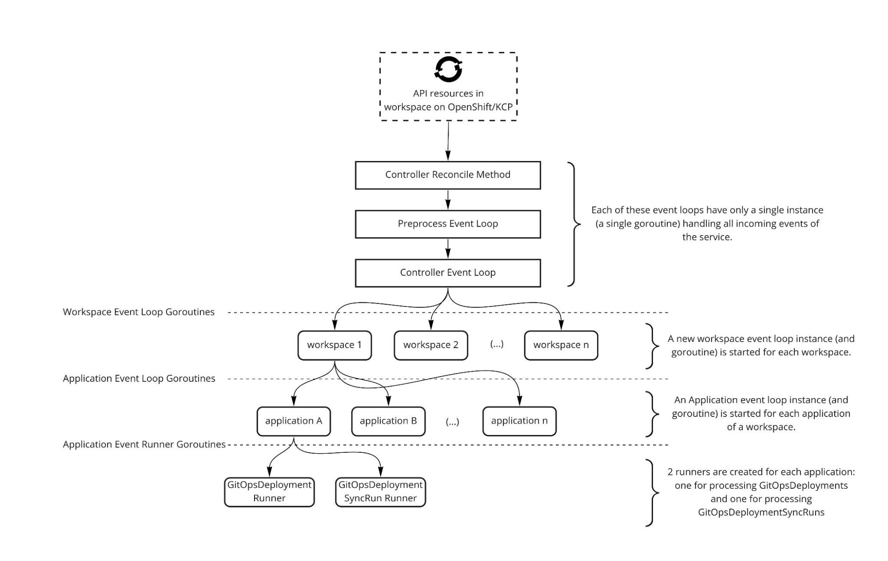
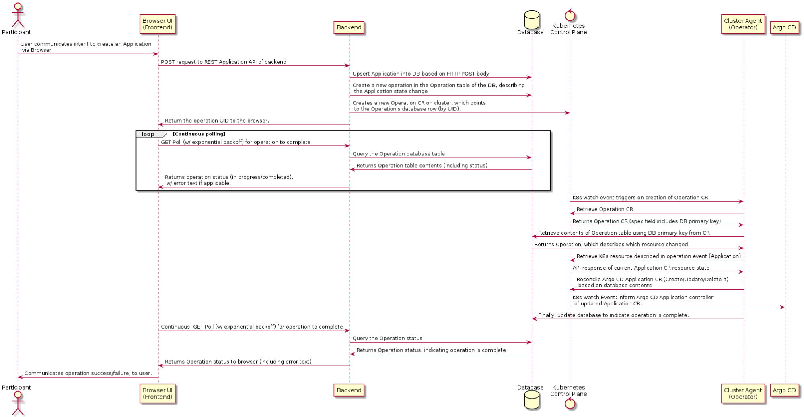

# AppStudio GitOps Internal Architecture

### Written by
- Jonathan West (@jgwest)
- Originally written in Q4 2021/Q1 2022, and supplemented in 2022 and 2023.


See [Terminology](../overview-gitops-service-in-appstudio-2021.md) in overview doc.

# Terminology

**Application (Argo CD):** Argo CD has a custom resource, Application, which represents a source GitOps repository contains K8s resources (for example, Deployments, ConfigMaps, Services), and a destination K8s cluster/namespace to deploy them to.

* Not to be confused with Application AppStudio resource, or with the Application RDBMS table (but closely related to RDBMS Application table)  
* Example Application CR can be found [here](https://github.com/argoproj/argo-cd/blob/master/docs/operator-manual/application.yaml).

**AppStudio Product UI (HAC)**: Responsible for communicating with other AppStudio components, including setting up Application/Environment definitions for GitOps repository to use.

**Custom Resource (CR):** In addition to the built in resources that Kubernetes supports by default, such as Deployments, Services, ConfigMaps, etc, Kubernetes allows you to define your own custom resources through Custom Resource Definitions (CRDs). This capability is widely used by Kubernetes-based projects, like Argo CD.

**Managed GitOps Product Backend (gitops backend)**: Responsible for handling K8s API requests from HAC/HAS on KCP control plane, updating the RDBMS to represent the latest state of user’s intent, and for communicating the user intent to the appropriate Argo CD instance responsible for deploying from the user’s Git repository to the target cluster (KCP workspace).

**Managed GitOps Cluster Agent (cluster-agent)**:  A Kubernetes-controller responsible for ensuring that the Argo CD instances running on the cluster are conformant to user intent (as communicated via KCP CR APIs), and likewise ensuring that the state of resources in the shared RDBMS database is accurately reflected in the Argo CD state (cluster secrets, repository secrets, Application CRs).

Will also periodically (every *x* minutes) reconcile the relational database state with the Argo CD instance state, to ensure that they remain consistent. Note that this is a fall back mechanism:  the two really should already (and always) be in sync via controller resource watch behaviour, this is a guard against program errors and race conditions.

**Target Cluster**: The responsibility of a GitOps tool is to read Kubernetes resources from Git ([for example](https://github.com/argoproj/argocd-example-apps/tree/master/guestbook)), and write them to a Kubernetes namespace on a Kubernetes cluster. The cluster that we are ‘writing’ these K8s resources to is referred to as the target cluster. This cluster is the one specified in the Argo CD Application’s [Destination field](https://github.com/argoproj/argo-cd/blob/5e6aee5961d47dca928e17c61ff289f330e1b055/docs/operator-manual/application.yaml#L96), and the one specified in the *destination* field of *GitOpsDeployment*.

**Workspace / KCP Workspace / API Namespace**: This is the namespace (either a K8s namespace, or a KCP namespace if running on KCP) that contains API requests of the GitOps service.  For the GitOps service, our APIs are invoked by creating *GitOpsDeployment* CR and *GitOpsDeploymentSyncRun* CR.

* Example: If you want Argo CD to synchronize *https//github.com/jgwest/my-app* to a cluster named *my-cluster*, you would create a *GitOpsDeployment* CR in the workspace.   
* Next, the GitOps service would detect this CR (because the service is watching the namespaces for CRs that are part of its API), and ensure that Argo CD is setup as requested in the *GitOpsDeployment* CR.


# Architecturally Significant Requirements (Challenges in the problem space we need to solve)

These are some of the [architecturally significant requirements](https://en.wikipedia.org/wiki/Architecturally_significant_requirements) that drive the internal design of the GitOps Service.

**The GitOps Service must manage Argo CD: Argo CD is stateful, and that state is essential, mutable, and long lived:**

* Each Argo CD instance is a unique instance, containing mutable state: cluster secrets, repository secrets, deployed Applications.  
  * Contrast this with Tekton, whose resources are mostly fire and forget (short-lived builds)  
* The Argo CD state is essential: if the state is not preserved correctly, or mutated in an inconsistent way, it will lead to a service outage for Argo CD users.  
* The state is long lived (eg the lifecycle of the state is tied to the application, the Git repository, the target environment, all of which are long lived)  
* Thus: we need to ensure that the state of Argo CD is always preserved, is well tested in non-ideal situations (via stress/chaos tests), and is not subject to race conditions during state mutation.  
* Thus: the state of the GitOps Service is thus also essential, mutable, and long lived.  
* *Our solution*: write careful code, add detailed error logging, consider the potential for race conditions in all situations, and use E2E+stress testing+chaos testing to detect race condition corner cases.

**Some interactions with Argo CD may take tens of seconds, or minutes, blocking other synchronous tasks:**

* If/when we support dynamic creation of new Argo CD instances, standing up a new Argo CD instance could take 5 minutes  
* Argo CD sync operations can take many minutes to complete, in the worst case scenario.  
* Thus: these scenarios require us to support concurrent K8s resource reconciliation. (We can't rely on the default single-threaded Reconcile behaviour of *controller-runtime*)  
* *Our solution*: Split processing of resource events into a controller-\>workspace-\>application-\>application runner hierarchy of goroutines, described elsewhere.  
  * This allows us to single-threaded-style code, but without blocking other tasks.

**Some GitOps Service API resources have a parent-child relationship, BUT K8s does not guarantee processing of K8s watch events in a specific order:**

* The GitOpsDeploymentSyncRun resource references the GitOpsDeployment resource, but if both are created at the same time, we can't guarantee that SyncRun will be processed after Deployment.  
* We can't perform a sync operation on a GitOpsDeployment that hasn't been processed yet (no Argo CD Application exists for it yet).  
* Solution: See 'orphaned resources' description above for further details on this.  
* See [client-go's shared\_informer.go](https://github.com/kubernetes/client-go/blob/master/tools/cache/shared_informer.go) for a description of ordering and consistency behaviour.

**We need to maintain relationships between K8s resources with database resources (‘tie them together’):**

* Since we represent objects in both K8s and an RDBMS, we need to tie these two together (see 'data flows' elsewhere in the document for the relationship between the two)  
  * k8s resources identified by UID  
  * db resources identified by primary key  
* While this adds some complexity in some areas, it removes a significant amount of complexity in others. See 'Controllers miss resource deletion events that occur during a watch outage' and 'Why do we need to uniquely identify workspace API objects by UID' below for complexity reductions.

**We need to uniquely identify workspace API objects (by UID), but client-go does not give us this behaviour by default:**

* This exact issue is described by shared\_informer.go in client-go: "*Because \`ObjectMeta.UID\` has no role in identifying objects, it is possible that when (1) object O1 with ID (e.g. namespace and name) X and \`ObjectMeta.UID\` U1 in the SharedInformer's local cache is deleted and later (2) another object O2 with ID X and ObjectMeta.UID U2 is created the informer's clients are not notified of (1) and (2) but rather are notified only of an update from O1 to O2. Clients that  need to detect such cases might do so by comparing the \`ObjectMeta.UID\` field of the old and the new object in the code that handles update  notifications (i.e. \`OnUpdate\` method of ResourceEventHandler).*" ([source](https://github.com/kubernetes/client-go/blob/6964e37acfd3678087cfb1ced00774753c27ea96/tools/cache/shared_informer.go#L114))  
* Why do we need to uniquely identify workspace API objects by UID?  
  * Consider this scenario:  
    * 1\) A user creates a GitOpsDeployment object 'my-deployment', and it reconciles into an Argo CD Application resource.  
    * 2\) The user deletes the GitOpsDeployment, but the GitOps Service does not receive a notification for this deletion (for example, GitOps Service controller is down for the watch timeout, eg \>5 minutes)  
    * 3\) A user creates a new GitOpsDeployment object, with the same name.  
  * In a situation where we don't consider the UID, and just consider the resource name/namespace (which is the default controller-runtime Reconcile(...) behaviour), we hit a problem after step 3:  
    * The controller will not know that the previous 'my-deployment' object was deleted. Thus:  
      * The existing resources on the object will not be deleted.  
    * Instead it will appear that the content of the 'my-deployment' object changed.  
      * The status field of the new GitOpsDeployment object will be updated with the old status from the previous object.  
      * The state of the old Argo CD Application object will be incorrectly applied to the new GitOpsDeployment object.  
      * The existing K8s resources from the old object will show up under the new object (unless Argo CD prune is enabled)  
* Instead, the desired behaviour (which requires UID tracking), is:  
  * When the old object is deleted, all the previous objects/db entries referenced by the old 'my-deployment' object are deleted  
  * When the new object is created, it should be recognized as new, and should thus not share any state with the previous object with the same name.  
* Potential alternative solution: finalizer \+ admission controller to ensure that finalizer is always set

**When a GitOps Service API object is deleted, the controller-runtime doesn't give us the UID for this:**

* The controller-runtime Reconcile() will provide us with the resource name/resource namespace for any object that is created/modified/deleted. Which is great\!  
* BUT, when an object is deleted, there is no way for us to determine the UID of that object. The resource name/namespace can not be used to retrieve a resource, because by definition the resource doesn't exist.  
* This is only an issue because of the need to uniquely identify workspace API objects, described above.  
* *Our solution*: For each resource we see, we need to maintain: (resource name, resource namespace, resource uid), with the ability to search by (resource name, resource namespace) to get the UID of a resource.  
  * This state is maintained in the RDBMS by DeploymentToApplicationMapping (for GitOpsDeployment resource) and APICRToDatabaseMapping (for GitOpsDeploymentSyncRun resource). It is also cached in the controller process.

**Controllers miss resource deletion events that occur during a watch outage:**

* A Kubernetes controller will not receive any events that occur while its watch is not active.  
* A watch is inactive when:  
  * The controller process is not running (eg controller Node goes down, the controller is crashing, or the controller it is taken down for maintenance)  
  * Network connection issues between controller and control plane (must last \>5 minutes, eg the watch timeout)  
* This primarily affects detection of deleted resources.  
* Here is an example of the failing case:  
  * 1\) User has a GitOpsDeployment object  
  * 2\) Controller process goes down, or stops receiving events  
  * 3\) User deletes the GitOpsDeployment object from the workspace.  
  * 4\) Controller process comes up.  
  * 5\) The Controller reconciles all the objects that currently exist on the control plane, but does not reconcile deleted objects (because K8s has no mechanism to see resources which are deleted beyond the watch timeout)  
  * Since the deletion event was missed, the user will think their deployment is deleted. But, since the controller never received the deletion event, it is still running.  
* This issue is applicable to all K8s controllers, and is not specific to the GitOps service.  
* *Our solution*: Since we have a persistent RDBMS representation of the resources we have processed on the control plane, we can scan the RDBMS for resources that have been deleted, and ensure they are reconciled. (since our database is ACID compliant, it is guaranteed to fully describe the control plane, so there should be no outliers)  
* *Potential alternative solution*: finalizer \+ admission controller to ensure that finalizer is always set

# How ‘truth’ flows from Workspace API \-\> Database \-\> Argo CD cluster, in the GitOps service

The GitOps service is primarily responsible for ensuring that Kubernetes resources defined in Git repositories (which we refer to as GitOps repositories) are synchronized with a target Kubernetes cluster.

So, if a user wants to deploy (for example) their web application to a K8s cluster, they need to make sure that the Deployments/Services/ConfigMaps that constitute their application are defined in a Git repository.

However, the actual responsibility of reading *from* Git, and deploying *to* K8s, is the responsibility of Argo CD. It is very good at doing this, and is a popular tool within the industry for this task.

So where does this GitOps service fit in? Well the GitOps service needs to tell Argo CD what to do: what Git repositories to read from, and what K8s clusters to write to.

For the GitOps service, the user creates a *GitOpsDeployment* CR containing the information required. GitOpsDeployment is part of the GitOps service API.

The *GitOpsDeployment* CR looks like this:
```yaml
apiVersion: v1alpha1
kind: GitOpsDeployment
metadata:
  name: jgwest-app
spec:

  # GitHub repository containing K8s resources to deploy
  source:
    repository: https://github.com/jgwest/app
    path: /subpath/within/repo
    revision: master
 
  # Target K8s repository
  destination:
    # optional: if not specified, defaults to same KCP workspace as CR
    namespace: my-namespace

  type: manual # Manual or automated, a placeholder equivalent to Argo CD syncOptions.automated field
```

The *source* field indicates which Git repository to read K8s resources from, and the *destination* field indicates where to write those K8s resources.

The *GitOpsDeployment* CR is the single source of truth for ‘what git repositories to synchronize to which clusters within the GitOps service. Whatever the user specifies in the GitOpsDeployment will ultimately correspond to an Argo CD Application resource, and a deployment of K8s resources to the target cluster defined within the ‘destination’ field of the GitOpsDeployment.

***Sidebar: But I thought Git was the single source of truth in GitOps?***

With the GitOps philosophy (and with Argo CD), Git *is* the single source of truth *for the state of K8s resources on your target cluster.* This is still true with the GitOps service.

There are actually two truths, here:

* *Target cluster resources truth \- what K8s resources to deploy to the target cluster*: This is defined within Git, and are the specific definitions of the  Deployments, ConfigMaps, Services, Secrets, etc that are to be deployed to Kubernetes.   
  * This data (‘truth’) lives in Git, as is consistent with the GitOps philosophy.  
  * Argo CD is entirely responsible for handling the contents of this repository.   
  * Example: this ‘truth’ might look like [this](https://github.com/argoproj/argocd-example-apps/tree/master/guestbook).   
  * The GitOps service does not modify the contents of the repository (but other components in AppStudio will/might)  
* *Application configuration truth \- what (Git repository source \-\> K8s repository destinations) to deploy to.*  
  * This is defined within the GitOps Service workspace (via GitOpsDeployment CRs), not in Git.  
  * This truth is defined in the GitOpsDeployment resource, and everything flows from here.  
  * This ‘truth’ also contains other data:  
    * Credentials for connecting to target clusters (*GitOpsDeploymentManagedEnvironment* CR)  
    * Credentials for connecting to Git repositories (*GitOpsDeploymentRepositoryCredentials* CR)

  For this architecture section, we are always referring to Application configuration truth, not target cluster configuration truth (unless otherwise indicated)

So, as described above, the GitOpsDeployment CR describes what to synchronize. The GitOps Service watches for this CRs, reads it, and ultimately converts it into an Argo CD Application. For example:

```yaml
apiVersion: vargoproj.io/v1alpha1
kind: Application
metadata:
  name: jgwest-guestbook
spec:

  # GitHub repository containing K8s resources to deploy
  source:
    repoURL: https://github.com/jgwest/app
    path: /subpath/within/repo
    targetRevision: master
 
  # Target K8s repository
  destination:
    # optional: if not specified, defaults to same KCP workspace as CR
    server: https://kubernetes.default.svc
    namespace: my-namespace

  # (other fields)
```

You’ll notice the *Application* CR and the *GitOpsDeployment* CR are very similar: this is both because they describe the same GitOps concept (synchronizing from a source Git repository to a destination K8s cluster), but also because we are aiming to keep them similar for compatibility/familiarity purposes.

## Truth flows down: what does this mean?

So with the GitOps service, we are primarily concerned with ‘*Application configuration truth*’: what Git repositories to sync from, what K8s clusters to sync to, and what connections to make between those two (which Git repos \-\> to which clusters).

This data is described in *GitOpsDeployment* CRs, as described above. 

But how does this data get from the GitOpsDeployment CR, all the way down to Argo CD running on our GitOps engine cluster? And how is the RDBMS (PostgreSQL) involved?

At a high level, data (“truth”) flows down, like this:

1) User creates/modifies/deletes a GitOpsDeployment resource in the API workspace, for example by running ‘kubectl apply’.  
   * (Note: in AppStudio, the user is actually another AppStudio service, like the AppStudio UI or HAC components. We aren’t yet giving actual users access to the API workspace, for example using kubectl apply, as of this writing.)  
2) This change is detected by the GitOps backend service, and the backend service updates the corresponding database entry (usually, an Application row).  
3) The backend informs that cluster-agent (running on the same cluster as Argo CD) that the Application database entry has changed.  
   * The backend informs the cluster agent by creating an Operation CR on the cluster, which the cluster-agent is watching for. The Operation CR points to the Application database entry that changes. See a description of how operations work, below.  
4) The cluster-agent detects the Operation, and retrieves the Application database entry. It compares the Application in the database, with the Argo CD Application CR defined in the Argo CD namespace (‘argocd’).  
   * If the Argo CD Application CR doesn’t exist in the Argo CD namespace, it is created.  
   * If the Argo CD Application CR exists, but the contents of it differs from what is in the database, then the Application CR is updated to be consistent with the content of the database.  
   * If the Argo CD Application CR exists, but it doesn’t exist in the database, the Argo CD application CR is deleted (this is the deletion case).  
5) Finally, Argo CD detects any changes (creation/modification/deletion) of the Argo CD Application CR, and responds accordingly.


Thus, from the above steps, you can see how the data (containing what we want to sync) went from the API workspace, to the  database, to the cluster running Argo CD, and then finally to Argo CD itself.

* Each layer should eventually become (eventually) consistent with the layer above it.  
* Usually, it should be very quick: a change made to the GitOpsDeployment CR should make it down to Argo CD Application CR within \<100 msecs.  
  * However, in the worst case it might take hours to become consistent\! For example, what happens if our database goes down, or if the cluster containing our Argo CD instances were to temporarily go down. Or, what if either was  inaccessible due to network issues?  
  * In this case, the GitOps service must fail gracefully, and wait for the failing resource (database, Argo CD cluster) to become available.  
  * Once it becomes available, the GitOps service should successfully complete any actions that were failing, and the system should return to the desired state (the one described by all of the GitOpsDeployment CRs in all the workspaces).  
    * This is why we say *eventually* consistent ([more info](https://en.wikipedia.org/wiki/Eventual_consistency)).

When a GitOpsDeployment CR is deleted, a similar path is followed:

1) GitOpsDeployment CR is deleted from the API workspace.  
2) The GitOps backend service detects this deletion, and deletes the Application database entry (and any other related database rows)  
3) The GitOps backend service creates an Operation, informing the cluster-agent service that the Application database entry has changed (deleted).  
4) The cluster-agent detects this Operation, attempts to retrieve the corresponding Application database entry (detects that it doesn’t exist), and so deletes the corresponding ArgoCD *Application* CR that corresponds to that deleted Application entry.  
* Thus the new version of the data (the ‘truth’) again went from API workspace \-\> database \-\> GitOpsEngine cluster \-\> Argo CD.

## In contrast, at a high level, status information flows up 

1) Argo CD updates the *status* field of Application CR with a status and health:  
   1) *Sync Status*: Whether the K8s resources defined within the GitOps repository are consistent with what is defined on the target cluster. (It’s Argo CD’s job to keep them in sync\!)  
   2) *Health*: Whether those K8s resources are healthy (for example, a Deployment/Pod is unhealthy if the Pod’s container isn’t running)  
2) The cluster-agent detects changes to the status/health of the Argo CD Application CR, and updates the corresponding ApplicationState database entry.  
3) The GitOps service detects the change to the ApplicationState database table, and updates the corresponding status field of the GitOpsDeployment CR.

Thus, we went from Argo CD Application CR \-\> Database \-\> GitOpsDeployment CR, and from there the AppStudio UI (or similar tools) can  provide the user health/status information by reading the status field of the GitOpsDeployment CR.

## Digging a little deeper

So let's say the user has created a new *GitOpsDeployment* CR in the API workspace. 

Next, *GitOpsDeployment* CRs are converted into the corresponding database tables. In the GitOps service, this data is stored in a PostgreSQL relational database (RDBMS). 

For example, the above *GitOpsDeployment* CR would get turned into this Application database entry:

* Application\_id: (uuid)  
* Name: my-application  
* Spec\_field:   
  * (contains YAML, of source/destination fields based on the GitOpsDeployment source dest fields)  
  * source:  
    * repoURL: https://github.com/jgwest/app  
    * path:  /subpath/within/repo  
    * targetRevision: master  
  * destination:  
    * name: "my-cluster"  
    * namespace: "jgwest"

* Engine\_instance\_inst\_id: (uid to GitOpsEngineInstance table, identifying the specific Argo CD instance to deploy to)  
* Managed\_environment\_id: (uid to ManagedEnvironment table, identifying the specific target cluster to target)

Plus, it might also create these database table entries:

* *ManagedEnvironment*: Represents the target cluster that Argo CD will deploy the user's GitOps repository to. This is based on the 'destination' field of the GitOpsDeployment (if present)  
* *ClusterUser*: Represents the user who created the GitOpsServiceDeployment CR, stored within the database (person creating the GitOps API)  
* *ClusterCredentials*: Credentials for the target ManagedEnvironment cluster, the cluster described in the destination field of GitOpsDeployment CR. Argo CD will use these credentials to deploy with.  
* *ClusterAccess*: Cluster access tuple is created which identifies which Argo CD instance should deploy to which managed environment, for which user.  tuple: (cluster user, managed environment, gitops engine instance). This indicates which user can deploy to which argo cd / cluster.

Plus, if this is the first time the GitOps service has been invoked, create these database entries:

* *ClusterCredentials*: credentials for the GitOpsEngine cluster (the cluster containing Argo CD).   
  * This is different from the ClusterCredentials described above (which are for the user’s target cluster).  
* *GitOpsEngineCluster*: Represents a cluster containing 1 or more Argo CD instances  
  * Tracks the cluster containing Argo CD   
* *GitOpsEngineInstance*: Represents a single argo cd instance, running with a namespace of a gitops engine cluster  
  * Tracks the namespace containing Argo CD, on the cluster.

The various database entries are used to track the various moving pieces: 

* What Argo CD clusters are we using (so that we can support multiple clusters running Argo CD)  
* What Argo CD instances are we using (so that we can support multiple Argo CD instances per cluster)  
* What are the API credentials for all those clusters (so we can connect to them via the K8s API, and so we can setup Argo CD to connect to them for synchronization purposes.)  
* (etc…)

See Resource Synchronization with Operations below, for details on next steps.

# Event handling in GitOps Service backend 

**Note**: This section assumes you are familiar with Kubernetes controllers/operators. If you are not, you may wish to look at the [kubebuilder framework documentation](https://book.kubebuilder.io/introduction.html) (which introduces the concept of controllers) and the [operator framework documentation](https://sdk.operatorframework.io/docs/building-operators/golang/tutorial/) (which introduces operators, built on top of controllers.)

The GitOps Service follows a similar pattern to the Reconcile(...) functions that you may be familiar with from using the Operator Framework SDK/Kubebuilder/controller-runtime.

With traditional controller-runtime-based controllers/operators, a [Reconcile(...) method](https://github.com/argoproj-labs/argocd-operator/blob/fca995cf91faa3ac84aaf9f9be48136539a8e5a7/controllers/argocd/argocd_controller.go#L71) is called whenever an event occurs that is related to a particular custom resource (for example, the user creates an ArgoCD CR, in the case of the argo-cd-operator, which causes the argo-cd-operators’ ArgoCD Reconcile() method to be called.).

The same principle is used in the GitOps service, with the difference being that those reconcile events (resource changes) are now distributed across multiple goroutines. Our use of goroutines and message passing are consistent with the [actor model of concurrency](https://en.wikipedia.org/wiki/Actor_model).

Why do we distribute reconcile events across multiple goroutines, rather than just using a Reconcile function? 

Well, by default, the controller-runtime may only handle a single concurrent Reconcile event at a time, per resource.

So, in the worst case, something like this happens:

* *@0 seconds*: User A creates a *GitOpsDeployment* CR  
* *@0 seconds*: User B creates a *GitOpsDeployment* CR (both users create the resources at the same point in time)  
* *@0 seconds*: Controller starts processing User A's CR, which takes 5 seconds (for example, due to waiting for K8s API to respond to requests, of other I/O bound tasks)  
* *@5 seconds*: Controller completes processing User A's CR  
* *@5 seconds*: Controller finally starts processing User B's *GitOpsDeployment* CR. Unfortunately, this means that user B's request was stuck waiting 5 seconds, even though the controller could easily have started handling their request.

So you can see that User B unnecessarily had to wait 5 seconds for their resource to start being processed.

Fortunately, the number of concurrent Reconcile calls can be increased via [MaxConcurrentReconciles](https://github.com/kubernetes-sigs/controller-runtime/blob/188b48630db275131d0fef1818933d8c2da96753/pkg/controller/controller.go#L40) and/or [GroupKindConcurrency](https://github.com/kubernetes-sigs/controller-runtime/blob/1e4d87c9f9e15e4a58bb81909dd787f30ede7693/pkg/config/v1alpha1/types.go#L91) (GKC) in the *controller-runtime*.

BUT, even by increasing these values, it is still possible for one user to create enough requests to block all other users:

* MCr/GKC is set to 10 concurrent requests.  
* User A creates 10 CRs, which occupy all the concurrency 'slots'  
* All other users are stuck waiting for their requests to be processed.

Which is to say, to my knowledge there is no built-in support for request fairness or QoS between users, when using a controller written with the *controller-runtime*.

The GitOps Service attempts to solve this by sharding CR events (calls to Reconcile function) to multiple goroutines, organized into a controller-\>workspace-\>application (gitopsdeployment)-\>runner hierarchy, such that we have the ability to limit the number of active events per workspace (eg for a single user), or per application. This should also allow us to more easily implement custom QoS algorithms in the future.

This also simplifies our code by allowing us to write synchronous code which may wait on long I/O operations, without worrying about whether those long I/O operations are blocking the other users’ operations that are waiting in the queue to be processed. (The alternative would be asynchronous operations built around a state machine, with callbacks, which would be significantly more complex.)

## How event handling is implemented \- short version: 

The vast majority of the work of the backend service is done in the Application Event Runner (‘application\_event\_runner.go’), which works very similar to Reconcile() functions of a controller ([example](https://github.com/argoproj-labs/argocd-operator/blob/808a953de3f75e4da2f99a094f8184985a8c6c72/controllers/argocd/argocd_controller.go#L71)). The Application Event Runner is layer 6 in the list below.

The rest of the layers (event loops) are primarily responsible for starting new goroutines, and for passing any messages received to those started goroutines. The goroutines that are started correspond to new workspaces, or new GitopsDeployments. The diagrams below might help you build an intuition around how this works.

Layers (event loops) at the top of the list always pass messages to layers lower in the list (or in some cases, event loops will send themselves messages).

## How it's implemented \- long version: 

At a high level, resource events (Reconcile function calls) are passed between these 'layers' (event loops/goroutines), and are always handled in this order:

1. **Controller Reconcile function**: The Reconcile() method of the controller is called by controller-runtime logic, based on K8s watches. ([link](https://github.com/redhat-appstudio/managed-gitops/blob/93203355aaf24d9a0e9e203c29a6ba1db4968102/backend/controllers/managed-gitops/gitopsdeployment_controller.go#L48))  
   1. **NOTE**: All (**link**)s in this list point to this version of this code as of Feb 2022 (e.g. they are permalinks); for updated code, check the latest versions of these files in the codebase.  
2. **Pre-process Event Loop**: Messages from the Reconcile function are modified, adding some context information (doing "pre-processing" of messages) for the next layers. ([link](https://github.com/redhat-appstudio/managed-gitops/blob/93203355aaf24d9a0e9e203c29a6ba1db4968102/backend/eventloop/preprocess_event_loop.go#L32))  
3. **Controller Event Loop**: Responsible for starting a workspace event loop goroutine for each workspace. ([link](https://github.com/redhat-appstudio/managed-gitops/blob/93203355aaf24d9a0e9e203c29a6ba1db4968102/backend/eventloop/controller_event_loop.go#L32))  
4. **Workspace Event Loop**: Response for starting an application event loop for each GitOpsDeployment in the workspace (API namespace). ([link](https://github.com/redhat-appstudio/managed-gitops/blob/93203355aaf24d9a0e9e203c29a6ba1db4968102/backend/eventloop/workspace_event_loop.go#L70))  
5. **Application Event Loop**: Responsible for receiving events, and passing them to the Application Event runner for processing. ([link](https://github.com/redhat-appstudio/managed-gitops/blob/93203355aaf24d9a0e9e203c29a6ba1db4968102/backend/eventloop/application_event_loop.go#L25))  
6. **Application Event Runner**: This is where the vast majority of the work takes place. This is the code that is actually responsible for acting on messages (creating Argo CD Applications, Cluster Secrets, etc). ([link](https://github.com/redhat-appstudio/managed-gitops/blob/93203355aaf24d9a0e9e203c29a6ba1db4968102/backend/eventloop/application_event_runner.go#L41))


### Layers

Messages are always processed in this order, with each ‘layer’ passing to the next lower layer in the diagram.

#### 1\) Controller Reconcile(...) functions 

Contained within the controllers in controllers/managed-gitops, including *gitopsdeployment\_controller.go* and *gitopsdeploymentsyncrun\_controller.go*

The *Reconcile*() functions of these controllers are called by *controller-runtime* whenever a GitOpsDeployment or GitOpsDeploymentSyncRun are created/modified/deleted (and on initial controller startup).

The function passes all events received to the pre-process event loop, below.

#### 2\) Pre-process Event Loop

*Cardinality*: A single instance of the pre-process event loop (e.g. a single goroutine) exists for the whole of the GitOps Service backend.

The pre-process event is responsible for performing initial work (pre-processing) on events that come into the service. 

Receives events from controller 'Reconcile' functions.

~~This includes:~~

* ~~Detecting cases where the user deletes a resource, then creates a resource with the same name, before we have processed the delete.~~  
* ~~Ensures that the 'associatedGitopsDeplUID' field is set for all requests that are processed by the GitOps service.~~  
  * ~~If the event is for a GitOpsDeployment resource, then this field matches the UID of the GitOpsDeployment (but for deleted resources, we need to retrieve the uid from the database)~~  
  * ~~If the event is for a GitOpsDeploymentSyncRun, then this field matches the UID of the GitOpDeployment (the GitOpsDeployment is the parent of the GitOpsDeplyomentSyncRun; this is based on the GitOpsDeploymentSyncRun containing the name of GitOpsDeployment in the name field).~~

~~This:~~

* ~~Ensure that all events are associated with a GitOpsDeployment (a single 'parent' entity), or listed as 'orphaned' (eg GitOpsDeploymentSyncRuns that references a GitOpsDeployment that doesn't exist, see description of orphaned resources for details)~~  
* ~~We detect the problematic deletion/creation of a resource with the same name, case. (More on this case, elsewhere)~~

The function passes all events received to the controller event loop, below.

#### 3\)  Controller Event loop

*Cardinality:* A single instance of the controller event loop (e.g. a single goroutine) exists for the whole of the GitOps Service backend.

The controller event loop receives events from the pre-process event loop. Events received here will necessarily:

* Have the 'associatedGitopsDeplUID' field set. This field references either a GitOpsDeployment, or contains 'orphaned-resource' string (indicating it a GitOpsDeply doesn't exist)

The controller event loop maintains a list of active namespaces, which contain GitOps Service API resources.

The responsibility of the controller event loop is to:

* Shard events between namespace goroutines:  
  * e.g. Events on namespace 'A' go to the Workspace Event Loop instance responsible for handling namespace 'A'. Events on namespace 'B' go to the Workspace Event Loop instance responsible for handling namespace 'B'. Etc.  
* Ensure a new Workspace Event Loop goroutine is running for each active workspace. (When a new workspace is first encountered, a new instance of the goroutine is started).

#### 4\) Workspace Event Loop

*Cardinality:* 1 instance of the Workspace Event Loop goroutine exists for each API namespace that contains GitOps service API resources. (For example, if there are 10 workspaces, there will be 10 Workspace Event Loop instances/goroutines servicing those).

All events that occur within an individual API namespace will be received by an instance of a Workspace Event loop (running with a Goroutine).

The responsibility of the workspace event loop is to:

* Receive events for a single API namespace, from the controller event loop  
* Pass received events to the appropriate Application Event Loop, for the particular GitOpsDeployment/GitOpsDeploymentSync.  
* Ensure a new Application Event Loop goroutine is running for each active application (see below).  
* Look for orphaned resources that become un-orphaned. (eg A GitOpsDeploymentSyncRun is orphaned because it pointed to a non-existent GitOpsDeployment, but then the GitOpsDeployment it referenced was created.)  
  * If this happens, the newly un-orphaned resource is requeued, so that it can finally be processed.

#### 5\) Application Event Loop

*Cardinality:* 1 instance of the Application Event Loop exists per GitOpsDeployment CR (which also corresponds to 1 instance of the Application Event Loop per Argo CD Application CR, as there is also a 1:1 relationship between GitOpsDeployments CRs and Argo CD Application CRs).

All events that occur to a particular GitOpsDeployment CR, and any CRs (such as GitOpsDeploymentSyncRun) that reference GitOpsDeployment, are received by the Application Event Loop.

The responsibility of the Application Event Loop is to:

* Receive events for a single, specific application (a specific GitOpsDeployment, or a GitOpsDeploymentSyncRun that is referencing that GitOpsDeployment)  
* Pass received events to the appropriate application event runner.  
* Ensure an application event runner exists for each resource type.  
* Within an Application Event Loop:  
  * 1 application event runner exists for handling *GitOpsDeployment* events  
  * 1 application event runner exists for handling *GitOpsDeploymentSyncRun* events

#### 6\) Application Event Runner

*Cardinality*: 2 instances of the Application Event Runner exist per *GitOpsDeployment* CR:

* 1 ApplicationEventRunner responsible for handling events related to the *GitOpsDeployment* CR  
* 1 ApplicationEventRunner responsible for handling events related to the *GitOpsDeploymentSyncRun* CR

This is where the vast majority of the work takes place. This is the code that is actually responsible for acting on events. It is here that received events are processed, and the corresponding Argo CD Applications, Cluster Secrets, etc, are created.

The event handlers are implemented in a similar style to Reconcile() methods of controllers. Just like Reconcile() methods of controllers, the event runners:

* Receive a resource change event that originally originated from a K8s watch (the resource group/version/kind, name, and namespace)  
* Retrieve the corresponding resource from the namespace, based on that event  
* Reconcile that resource with the overall state of the system

The difference between controller Reconcile() functions, vs what we are doing here, is that we are ultimately reconciling against a database, rather than the K8s workspace:

* A traditional controller will receive K8s resource change events for a namespace, and (for example) update other K8s resources in that namespace  
* In contrast, our backend service will receive K8s resource change events for a namespace, and then update the resources in the RDBMS database.

For every event that is received, this is roughly what happens:

* Looks at the event that was received. The event will contain:  
  * *the type of the resource that changed*: Either GitOpsDeployment or GitOpsDeploymentSyncRun (as of this writing, Feb 2022).  
  * *name of the resource*: for example, 'my-gitops-deployment'  
  * *the namespace that contains the resource, which corresponds to the user*: for example, a 'jane' namespace, for a user with user ID 'jane'.  
  * the uid of the associated GitOpsDeployment resource (from the ‘associatedGitopsDeplUID’ field).  
* Finds the correspondings K8s resource (GitOpsDeployment/GitOpsDeploymentSyncRun) of the event  
* Compares that resource contents with what's in the database  
* Updates (creates/modifies/deletes) the corresponding database entries,  
  * If the resource doesn't exist in the database, but does exist in the namespace, then create it in the database  
  * If the resource DOES exist in the database, but doesn't exist in the namespace, then delete it from the database  
  * If the resource exists in both the namespace, AND the database, then see if there are any changes required (for example, the user changed one of the fields of the resource, which means we need to update the database.)  
* If the database was updated, inform the cluster-agent component of the changes, by creating an Operation, so that Argo CD can be updated (as described in Operation section, elsewhere).  
* The backend then waits for the Operation to be marked as completed (that means the cluster-agent has finished running it).

### Goroutines / Event Loop Instances

As described above, for some of the event loops only a single instance of that event loop (cardinality of 1\) is running within the GitOps Service backend process. Examples of this include the Preprocess Event Loop, and Controller Event Loop.

The remaining event loops are dynamically created based on API resources in the workspace:

* When a workspace (API namespace) is created, a new corresponding Workspace Event Loop/goroutine is started.  
* When a GitOpsDeployment resource is created in a workspace, a new Application Event Loop/goroutine is started.  
* The Application Event Loop starts two additional goroutines, which are the runners that process the actual events:  
  * Application Event Runner responsible for processing GitOpsDeployment events  
  * Application Event Runner responsible for processing GitOpsDeploymentSyncRun events

This demonstrates the hierarchy of Event Loops/goroutines.




As an example, if there are 100 workspaces, and each workspace has 5 applications, there will be 100 \* 5 \* 2 total goroutines (\# of workspace \* number of applications \* number of runners). Fortunately, [Goroutines are built to be memory and CPU efficient](https://go.dev/doc/faq#goroutines), and can easily handle large numbers of these primarily I/O bound tasks. 

# Resource synchronization with Operations 

## Terminology

**Resources**:  Resources are the entities which correspond to resources within the Argo CD namespace of the user’s Argo CD instance. They also correspond to resources which exist in the PostgreSQL relational database. See below for more details.

**Database resource state**: The state of resources, as stored within the relational database (database table entries in the RDBMS)

**Cluster resource state**: The state of resources, as stored within the Argo CD instance namespace (eg Application CR, cluster/repository Secrets).

## Resources

Resources are:

1) Resources are the entities which correspond to resources within the Argo CD namespace of the user’s Argo CD instance.  
2) They also correspond to resources which exist in the PostgreSQL relational database.

These resources should be in sync with each other (RDBMS is the single source of truth for the desired state of these resources). 

**Example Resources:**

* *Managed Environment*  
  * RDBMS: ManagedEnvironment table  
  * ArgoCD Namespace: Secret with label ‘*argocd.argoproj.io/secret-type: cluster’*  
* *Operation*  
  * RDBMS: Operation table  
  * Argo CD Namespace: Operation CR  
* *Argo CD Instances*  
  * RDBMS: GitopsEngineInstance  
* Application:  
  * RDBMS: Application / ApplicationState tables  
  * Argo CD Namespace: Application CR

See the [DB Schema](https://github.com/jgwest/managed-gitops) in GitOps service GitHub repo for current resource definitions.

## Resource synchronization

It is necessary to keep the database resource state (state of resources as described in the PostgreSQL database) synchronized with the Argo CD cluster resource state (state of those same resources as described in the Argo CD namespace), and vice versa.

**Examples of resource changes that need to be handled by cluster agent:**

- *User creates a new Application via AppStudio UI*  
  - The GitOps backend must detect this (via k8s watch API) and update the list of Argo CD Applications in the Application PostgreSQL table   
  - The cluster agent must add the corresponding cluster/repository Secret to the Argo CD instance responsible for managing this cluster  
- *An Argo CD Application health/status changes*  
  - The cluster agent must detect this (via k8s watch API) and update the DB table containing Application health/status, so that this information can be updated within the K8s API.

Resource synchronization from the backend to the Argo CD cluster instance is handled with **Operations**, described below. *This is how truth flows down*, from the RDBMS to the Argo CD instance.

In the reverse direction, resource synchronization from the Argo CD cluster instance (primarily the Application status field) to the product frontend/backend, is handled by updating table rows in the RDBMS. *This is how status flows up*, from Argo CD back to the GitOps Service APIs.

## Operation

Resource synchronization from the RDBMS, to Argo CD (via cluster agent), is handled by Operations.

Operation is perhaps a misnomer; but think of it as shorthand for a ‘notification of resource change, sent from the product backend to the Argo CD cluster instance’. It has some properties of a notification, and some of an action, hence the more neutral term ‘operation’.

An operation is:

- **One way**: Synchronization primitive *from* product frontend/backend *to* the Argo CD instance on cluster.  
- **Asynchronous**: It is up to the frontend/backend to poll the operation state to wait for it to change, before informing the user of success/failure.  
- **Ephemeral**: operations are valid for a short period of time, corresponding to the time it takes for them to be processed, and then GC-ed.  
- **Do not prescribe a specific action**: Informs the cluster that a database resource has changed, but not how it has changed.  
  - It is up to the cluster to query the RDBMS, retrieve the up-to-date resource state, and reconcile it with the local copy.  
  - Not prescribing a specific action is necessary to avoid race conditions in the ordering of how operations are processed.  
- **Unordered**  
  - An operation is not guaranteed to be processed by the cluster agent in any particular order, hence it cannot prescribe an action (as above)  
- **Completable**: An operation should be listed as completed, once it has been fully processed by the cluster agent. Once processed, a cluster agent should mark the operation as complete within the RDMS.

Example:

* Credentials for a new ‘my-cluster-1’ have been added to the database by the user creating a Workspace/Application via AppStudio UI:  
  * Which would translate into Operation fields:  
    * *Resource changed at*: (timestamp)  
    * *Resource Name*: ‘my-cluster-1’  
    * *Resource Type*: ManagedEnvironment  
* Credentials for that ‘my-cluster-1’ have been removed by the user (for example, user deletes a Workspace/Application via HAC)  
  * Which would translate into Operation fields:  
    * *Resource changed at*: (timestamp)  
    * *Resource Name*: ‘my-cluster-1’  
    * *Resource Type*: managed environment

Why is there not an operation that synchronizes in the reverse direction, from the Argo CD instance cluster to the product backend?

* At present, there are no use cases where it is necessary to communicate state changes from the instance cluster to the product frontend/backend.  
* That is, it is sufficient to merely update the resources in the RDBMS, and allow the product backend to pick up the state change from there.  
* However, in the future, in order to scale to a large number of users, it will likely be beneficial to introduce this reverse synchronization operation (e.g. to avoid over-polling the database).

## Operation Data Flow

An example of how each of the components work together, starting with the user creating an Application/workspace from the UI:

1. AppStudio frontend:  
   1. The user creates a new Application in the AppStudio UI.   
   2. Another component (HAS) creates a GitOps repository for this application, and a corresponding GitOpsDeployment CR is created.  
2. GitOps Service backend (controller):   
   1. The backend is watching for creation/updates to GitOpsDeployment CR, and receives the request.  
   2. The backend receives the request, does initial validation of the request (for example, checks the database to ensure the cluster doesn’t already exist).  
      1. If the request is invalid, an error is reported, and no operation is created.  
   3. Updates the resource in the database, to reflect new expected state (acts on create/delete/update of entity).  
      1. In this example, a new ManagedCluster row will be added to the table.  
   4. Create a new Operation row in the database, to inform the target Argo CD cluster instance of a state change that it needs to respond to (the new managed cluster).  
      1. The Operation row points to the entity that was created/removed/modified (eg a row in the ManagedCluster database table).  
   5. Backend creates a new *Operation* CR on cluster, which points to the database Operation row by primary key (operation UID).  
   6. Waits for the Operation database row to have status of ‘complete’.  
3. Cluster Agent controller running on Argo CD cluster  
   1. The cluster agent component is watching namespace(s) for Operation CRs, and sees a new Operation CR that needs to be processed.  
   2. Retrieves the operation database row UID from the Operation CR, and retrieves the contents of that operation row from the database.  
   3. The operation references a resource (ManagedEnvironment, in this case), so the resource is retrieved from the database. This is the *database resource state*.  
   4. Next, the controller compares the *database resource state*, with the contents of that same resource on the cluster (*cluster resource state*).  
      1. If they are the same: Continue to the next step.  
      2. If they are not the same:  
         1. Exists in the DB, not on the cluster: create it on the cluster  
         2. Does not exist in the DB, exists on the cluster: delete it on the cluster  
         3. Exists in both, but contents differs: Replace *cluster resource state* with *database resource state*. (*Remember*: operations are one-way syncs from backend/DB to cluster, truth always flows down)  
   5. Finally, updates the operation state in the RDBMS to indicate that the operation has been processed (including success/failure, and a human readable error message if applicable. Status always flows up.)  
4. GitOps Service backend (controller)  
   1. The backend has been waiting for the Operation database table to have status of ‘complete’. The cluster agent updated the status to ‘complete’ in the previous step.  
   2. The GitOps service updates the ‘status’ field of the GitOpsDeployment CR with the status of the operation.  
5. AppStudio frontend:  
   1. The frontend provides the results of the operation back to the user, based on the status field of the GitOpsDeployment CR.  
      1. On completion, the operation will contain success/failure, which should be reported to the user (where applicable). 

**Note**: Steps 3 and 4 happen concurrently \- the frontend will poll until the cluster agent has finished processing the operation)

### Updating resources via operations, with cluster-based operator and RDBMS (Outdated) 

This is the end-to-end flow of a user creating an Application (**note**: this diagram uses REST API, which is outdated; everything to the right of backend – including backend – should be the same as this writing, Feb 2022):  



The workflow is the same for other types of resources (managed cluster credentials, private Git repository credentials, etc) and other types of operations (create/update/delete).

### Supported Operation Resources

For any change that needs to be made to an Argo CD instance, [an Operation should be created](https://github.com/redhat-appstudio/managed-gitops/blob/93203355aaf24d9a0e9e203c29a6ba1db4968102/db-schema.sql#L160). The operation takes this form:

* Gitops engine instance id: (reference to the Argo CD instance that this operation should act on)  
* Pointer to a row in the RDBMS:  
  * Resource type: cluster access / GitopsEngineInstance / application   
  * Resource id: (id of primary key in RDBMS)  
* Status  
  * Set by cluster-agent to allow the status of the operation to be returned to the frontend

As of this writing, the following operations are supported:

**Operation with Resource Type of ‘ClusterAccess’:**

- Why: When cluster credentials should be added/modified/deleted from an Argo CD instance (to allow Argo CD to watch/deploy to a user’s workspace or external cluster), an operation pointing to a cluster access should be created.  
- How:  
  - When cluster-agent sees a ClusterAccess operation:  
    - If ClusterAccess RDBMS row doesn’t exist: delete the corresponding Argo CD cluster secret for the cluster access  
    - If RDBMS row exists, but corresponding Argo CD cluster secret doesn’t exist: Create the Argo CD cluster secret  
    - If both exist, ensure that the cluster secret matches the row (one way sync, rdbms \-\> cluster secret).

**Operation with Resource Type of ‘Application’:**

- Why: When a new Argo CD application should be created (i.e. for the purpose of connecting a GitOps repo to a k8s cluster)  
- How:  
  - When cluster-agent sees a Application operation:  
    - If Application RDBMS row doesn’t exist: delete the corresponding Argo CD Application  
    - If RDBMS row exists, but corresponding Argo CD Application doesn’t exist: Create the Argo CD Application  
    - If both exist, ensure that the Application contents matches the RDBMS row (one way sync, rdbms \-\> cluster secret).

**Operation with Resource Type of ‘GitOpsEngineInstance’:**

- Why: Create a new Argo CD instance (but: dynamic instance creation not supported at this time, see the corresponding JIRA item).

## Operation CRD 

This is an example of an Operation CR on the cluster. This CR is created when there is an operation that needs to be reconciled on the cluster.

```yaml
apiVersion: managedgitops.io/v1alpha1
kind: Operation
metadata:
  # Name is based on the id of the operation within the db
  name: operation-966e35f5-1b89-4a89-b07d-0fc37fb6c998
spec:
  # Reference to primary key of Operation in table of RDBMS
  operationID: a79a64d8-7a23-4324-877f-0b1a11636a7e
```

Notice that the actual CR has very little detail: this is because the source of truth for the resource contents is the RDBMS.

**On seeing an Operation CR, it is the responsibility of the controller to:**

1. Retrieve the details of the operation from the DB, using the *operationID*  
   1. The operation will reference a resource in the database.  
2. Retrieve the referenced resource from the database, and compare it with the corresponding resource on the cluster  
3. Update the cluster resource to be consistent with the database resource (create the cluster resource, modify the cluster resource, delete the cluster resource, etc)  
4. Update the ‘status’ field in the DB table on completion, of the operation  
   1. This lets the Web UI know that the operation is complete.  
5. Once an Operation is complete, the controller should delete the CR. (The backend will handle deleting the corresponding DB table).

# FAQ

### What are the DeploymentToApplicationMapping, KubernetesToDBResourceMapping, and APICRToDatabaseMapping, database tables for? 

The primary problem solved by these database tables, is: how to keep track of the direct relationship between:

* resources defined in the database (such as GitOpsEngineInstance for Argo CD instances, or ManagedEnvironment for cluster credentials)  
* and, resources defined in Kubernetes (Namespaces on the Argo CD cluster, or Namespaces that are API namespaces)


For a number of cases, there is a direct 1-1 mapping between resources in Kubernetes, and the corresponding database table, and these tables keep track of that relationship.

**For example:**

The GitOpsEngineInstance database table tracks Argo CD instances on the cluster, and a single GitOpsEngineInstance row tracks a single Argo CD instance within a namespace.

The cluster-agent component will often receive controller *Reconcile*(...) method calls, which are notifications of Argo CD *Application* resource changes in the Argo CD namespace.

* For example, when Argo CD updates the health/sync status fields of an Application, then the cluster-agent will be notified of this by a Reconcile(...) method call on cluster-agent’s Application controller (so that cluster-agent can update its own database).

But, as above, when the cluster-agent receives a *Reconcile*(...) event on an Argo CD Application resource in an Argo CD namespace, how do we figure out which GitOpsEngineInstance (Argo CD instance) database table this event is for?

* The Reconcile call tells us which namespace the event occurred in, but how do we keep track of which Argo CD instance (defined in our database) this event is for?

For this scenario, we keep track of this relation with the *KubernetesToDBResourceMapping* table. There would be an entry in the table that looks like this:

* **kubernetes\_resource\_type**: Namespace  
* **kubernetes\_resource\_uid**: (uid of namespace on Argo CD cluster)  
* **db\_relation\_type**: GitOpsEngineInstance  
* **db\_relation\_key**: (primary key of GitOpsEngineInstance row in database)

Thus, in order to find out which GitOpsEngineInstance row corresponds to which Argo CD namespace, we can can query the KubernetesToDBResourceMapping like this:

*Select:*

* ***db\_relation\_key*** field

*Where:*

* **kubernetes\_resource\_type**: “Namespace”   
* **kubernetes\_resource\_uid**: (uid of namespace we are curious about)  
* **db\_relation\_type**: “GitOpsEngineInstance”

Since we have defined the relationship db \<-\> k8s in our database, this SELECT statement will give us the primary key of the GitOpsEngineInstance row which corresponds to this Argo CD namespace.

   	   
**Further details:**

We have three different tables for maintaining a persistent relationship between K8s resources and database fields: *DeploymentToApplicationMapping*, *KubernetesToDBResourceMapping*, and *APICRToDatabaseMapping*.

Within the GitOps Service, we need to keep track of what is going on in a few places:

* In the user's API namespace: which API resources (GitOpsDeploymentSync/GitOpsDeploymentSyncRun) in the namespace correspond to which database entries  
  * GitOpsDeployment resource in API namespace \<-- *DeploymentToApplicationMapping* \--\> *Application* table in database

* Argo CD Namespace on a cluster \<-- *KubernetesToDBResourceMapping* \--\> GitOpsEngineInstance  
* Kube-system namespace on a cluster \<-- *KubernetesToDBResourceMapping* \--\> GitOpsEngineCluster  
* Namespace we are deploying to \<-- *KubernetesToDBResourceMapping* \-\> ManagedEnvironment

*  GitOpsDeploymentSyncRun CR \<-- *APICRToDatabaseMapping* \--\> SyncOperation  
*  GitOpsDeploymentManagedEnvironment CR \<-- *APICRToDatabaseMapping* \--\> ManagedEnvironment

How does this help? Well, in the code, you can use these database tables to answer questions like this:

* If I receive an event from an Argo CD namespace, how do I figure out which GitOpsEngineInstance corresponds to this Argo CD instance? (A: query the KubernetesToDBResourceMapping, with GitOpsEngineInstance db type)  
* If I receive an event from a GitOpsDeploymentSyncRun resource, how do I figure out which SyncOperation database row it refers to? (A: query the APICRToDatabaseMapping, with GitOpsDeploymentSyncRun resource type)

There are three resources which do similar things, but have different scopes:

* **DeploymentToApplicationMapping**: Track relationship of GitOpsDeployment API resource, between API namespace, and database.  
* **KubernetesToDBResourceMapping**: Track relationship of Namespace resources on cluster/argo cd namespace, and database.  
* **APICRToDatabaseMapping**: Track relationship of GitOpsDeployment\* API resources (except GitOpsDeployment itself) between API namespace, and database.

### What is the kube-system namespace used for in the code?

We need a way to uniquely identify a Kubernetes cluster, and to do so in a way that is immutable.

* Whatever mechanism we use needs to always return the same value, forever.   
* Could we use the host of the cluster, for example: ci-ln-206d4kt-72292.origin-ci-int-gce.dev.rhcloud.com  
  * No: the host could change, if the administrator of the cluster decides to move the cluster or change the hostname.  
  * No: difficult to determine the host in a reliable way, from the perspective of a process running inside the cluster.

Why do we need this?

* We need to track which cluster Argo CD instances (our GitOps Engine instances) are running on  
* We need to track which clusters we are deploying to (via managed environments)

Specifically, we need a way to get a unique id (UID) for each cluster that the GitOps Service is interacting with.

* For example:  
  * ClusterA \= 72216773-df9d-43ad-a27e-3f221f438769  
  * ClusterB \= cb0fbce7-2a48-45e6-a345-2b479235848f

Unfortunately, to my knowledge, Kubernetes does not provide an API that gives us a unique ID for a cluster. 

So, my solution is to use the .metadata.UID field of the ‘kube-system’  Namespace, to represent the cluster. 

* the kube-system namespace is unlikely to ever be deleted/recreated, so the UID shouldn’t change throughout the lifecycle of the cluster.   
* Thus, if we ever want a unique ID that represents the actual cluster we are on, we can lookup the ‘kube-system’ Namespace, and check its .metadata.UID field.

### What is an ‘API namespace’?

*Short answer:*

An API namespace is just a term for a Kubernetes namespace (or KCP namespace on a workspace) where we (the GitOps Service) are listening for GitOps Service API resources.

Inside the namespace, a user (or AppStudio) may create GitOps Service APIs, such as the GitOpsDeployment resource. The GitOps service watches each of these namespaces for these API resources, and presumes that each namespace is owned by an individual user (eg namespaces are the primary mechanism for multitenancy).

In the context of AppStudio on dev cluster, that namespace is owned by a single user (it's slightly more complex than this, but this is the basic idea).

*More details*:

The GitOps service supports two custom resources (as of this writing): GitOpsDeployment and GitOpsDeploymentSyncRun. (Additional resources will be added in the short and medium term, as described in the API doc)

It is the job of the GitOps Service to watch for creation/modification/deletion these resources, and respond to them, as described in the \[AppStudio GitOps API and Deployment Workflow\] doc.

The GitOpsService will watch for these resources in namespaces on a Kubernetes cluster (or namespaces on a KCP instance).

AppStudio and the GitOps service (as of this writing) assume that each user (or group of users) will be confined to a single namespace. For example, user 'jgw' can only create K8s resources in the 'jgw' namespace.

Thus, in the context of the GitOps Service, any namespace in which the user can create GitOps Service APIs, is known as an API namespace.

### What is an orphaned resource?

Currently, the only resource that can be orphaned is the GitOpsDeploymentSyncRun resource.

A GitOpsDeploymentSyncRun is orphaned if it refers to a GitOpsDeployment that does not exist.

*For example:*
```yaml
apiVersion: managed-gitops.redhat.com/v1alpha1
kind: GitOpsDeploymentSyncRun
metadata:
  name: my-gitops-deployment-sync-run
spec:
  gitopsDeploymentName: my-gitops-depl  # but what if there is no corresponding 'my-gitops-depl' resource in the namespace
  revisionID: master
```

This GitOpsDeploymentSyncRun has a 'gitopsDeploymentName' field, which should reference a GitOpsDeployment resource in the namespace with that name.

In this case, there SHOULD exist a GitOpsDeployment CR named 'my-gitops-depl'.

But what if that resource doesn't exist? This would mean that the user (API consumer) is trying to invoke a sync operation on what is essentially a nil/null value, which is not possible.

We do not know which specific GitOpsDeployment object should handle this sync run request.

In this situation, our code flags the GitOpsDeploymentSyncRun as an **orphaned resourc**e, meaning that resource can not be processed until a corresponding parent resource exists (the GitOpsDeployment). Once the user creates a 'GitOpsDeployment' CR named 'my-gitops-depl', the GitOpsService will "un-orphan" the GitOpsDeploymentSyncRun, and the processing of that resource will proceed as normal.

A list of orphaned resources for each workspace is maintained in the Workspace Event Loop.

Orphaned resources as a concept are necessary in order to avoid the race conditions where a GitOpsDeployment and a GitOpsDeploymentSync run are created at the same time, and processed in an undesired order. 

This is the situation we want to avoid:

1. User creates GitOpsDeployment, and GitOpsDeploymentSyncRun, in quick succession (for example as part of the same 'kubectl apply').  
2. GitOps service controller receives watch event notification, from K8s, for GitOpsDeploymentSyncRun first.  
   1. The order in which resource watch events will be processed by the controller is not something we control, and thus sometimes we will receive the child resource notification before the parent.  
3. The controller attempts to reconcile the SyncRun, but the parent hasn't been processed yet, so it fails. (The SyncRun references the parent as a field within the spec)  
4. The controller receives the watch event notification for the GitOpsDeployment, and reconciles it, which succeeds, but we have no efficient way of requeue-ing the failed SyncRun.

# Challenges

## Argo CD is not necessarily built for low-touch, self-service, untrusted multitenancy 

Argo CD is primarily built for an environment where users are:

* **Multitenant, but mostly trusted tenants**: everyone who can access the Argo CD are employees employed by the same organization, with the Argo CD managed by the organization)  
* **High touch**: If there are issues with the behaviour of Argo CD, the administrator of the Argo CD instance is available (likely employed by the same organization) to handle diagnose and handle questions  
  * But as a team we obviously don’t want to be on-call as administrators for all of our user’s Argo CD instances, thus the need for a “low touch” solution.

It is therefore not necessarily built for our use case, which is:

* **Multitenant, but fully untrusted**: I expect our sign-up requirements will be minimal (similar to DevSandbox/Kafka), thus we must wholly guard against malicious users.  
* **Low touch**: As a team we obviously don’t want to be on-call as administrators for all of our user’s Argo CD instances, thus the need for a “low touch”, self-service solution. 

Potential solutions/mitigations:

* Maintain high-quality self-service tools for users  
  * If the underlying Argo CD instance somehow gets into a ‘bad state’, the user has a self-service (or autonomous) way to return it to ‘a good state’ without opening a support ticket.  
* We may need to create a light downstream fork of Argo CD with modifications to better support multi-tenancy  
  * We should upstream all Argo CD changes that we find beneficial for our own users (both for the greater good of the community, but also because it makes it easier to maintain those needed patches)  
  * BUT,  we may need to make emergency patches to the Argo CD used in our environment,  
  * And, we may need to maintain a testing ground for patches before they are ready upstream.   
  * (Hence it is only a ‘light’ fork)  
* Rather than running Argo CD as part of a provider managed fleet, instead run Argo CD within the unprivileged user cluster (for example, within a DevSandbox namespace).  
* As a potential last resort, move away from Argo CD (Gitops-engine? GitLab agent?)

