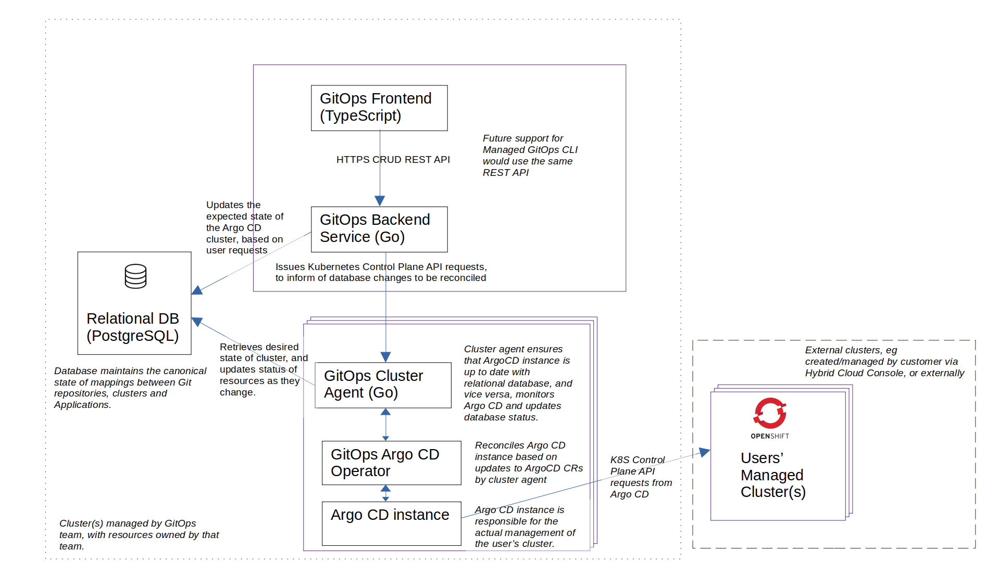
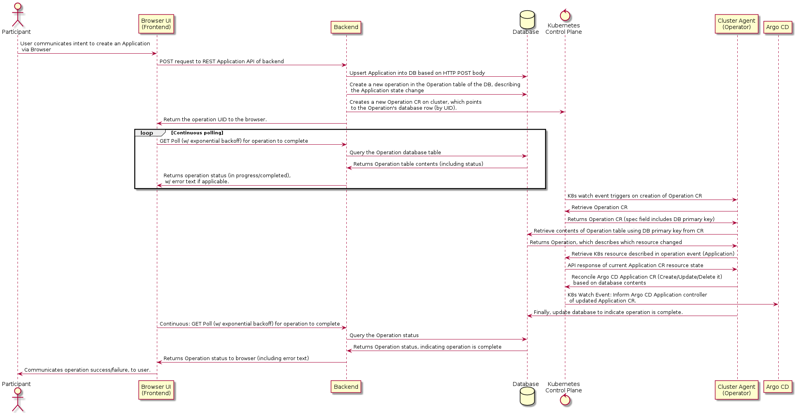

# Managed GitOps Architecture




# Terminology

**Resources**:  Resources are the entities which correspond to resources within the Argo CD namespace of the user’s Argo CD instance. They also correspond to resources which exist in the PostgreSQL relational database. See below for more details.

**Database resource state**: The state of resources, as stored within the relational database (database table entries in the RDBMS)

**Cluster resource state**: The state of resources, as stored within the Argo CD instance namespace (eg Application CR, cluster/repository Secrets).

# Components

**Managed GitOps Product UI**: The PatternFly-based Web UI used to do initial configuration of the Argo CD instance, and interact with the Applications/Clusters/Repositories that it manages. Note this is different from the Argo CD UI, which is not PatternFly-based, but there is much overlap between the UI data.

**Managed GitOps Product Backend**: Responsible for handling web requests from the front end, updating the RDBMS as needed, and communicating the user intent (via those requests) to the appropriate Argo CD instance environment.

**Managed GitOps Cluster Agent**: 

A Kubernetes-controller responsible for ensuring that the Argo CD instances on the cluster are conformant to user intent (as communicated via the product UI), and likewise ensuring that the state of resources in the shared RDBMS database is accurately reflected.

Will also periodically (every *x* minutes) reconcile the relational database state with the Argo CD instance state, to ensure that they remain consistent. Note that this is a fall back mechanism:  the two really should already (and always) be in sync via controller resource watch behaviour, this is a guard against program errors and race conditions.

# Concepts

## Resources

Resources are:

1) Resources are the entities which correspond to resources within the Argo CD namespace of the user’s Argo CD instance.  
2) They also correspond to resources which exist in the PostgreSQL relational database.

These resources should be in sync with each other (both *A)* and *B)* are sources of truth), with simple logic needed for reconciling collisions.

Example Resources:

* *Managed Clusters*  
  * RDBMS: ManagedCluster table  
  * ArgoCD Namespace: Secret with label ‘*argocd.argoproj.io/secret-type: cluster’*  
* *Operation*  
  * RDBMS: Operation table  
  * Argo CD Namespace: Operation CR  
* *Argo CD Instances*  
  * RDBMS: GitopsEngineInstance  
* Application:  
  * RDBMS: Application / ApplicationState tables  
  * Argo CD Namespace: Application CR

See the [POC SQL DB Schema](https://github.com/jgwest/managed-gitops) for current resource definitions.

## Resource synchronization

It is necessary to keep the database resource state (state of resources as described in the PostgreSQL database) synchronized with the cluster resource state (state of those same resources as described in the Argo CD namespace), and vice versa.

**Examples of resource changes that need to be handled:**

- *User adds a new managed cluster via the Web UI:*  
  - The cluster agent must add the corresponding cluster Secret to the Argo CD instance responsible for managing this cluster  
- *User adds a new Application to Argo CD, via the Argo CD Web UI*  
  - The cluster agent must detect this (via k8s watch API) and update the list of Applications in the Application table PostgreSQL  
- *An Argo CD Application health/status changes*  
  - The cluster agent must detect this (via k8s watch API) and update the DB table

Resource synchronization from the Product Frontend/Backend to the Argo CD cluster instance is handled with Operations, described below.

In the reverse direction, resource synchronization from the Argo CD cluster instance to the product frontend/backend is handled by updating table rows in the RDBMS. 

## Operation

Operation is perhaps a misnomer; but think of it as shorthand for a ‘notification of resource change, sent from the product frontend/backend to the Argo CD cluster instance’. It has some properties of a notification, and some of an action, hence the more neutral term ‘operation’.

An operation is:

- **One way**: Synchronization primitive *from* product frontend/backend *to* the Argo CD instance on cluster.  
- **Asynchronous**: It is up to the frontend/backend to poll the operation state to wait for it to change, before informing the user of success/failure.  
- **Ephemeral**: operations are valid for a short period of time, corresponding to the time it takes for them to be processed, and then GC-ed.  
- **Do not prescribe a specific action**: Informs the cluster that a database resource has changed, but not how it changes  
  - It is up to the cluster to query the RDBMS, retrieve the up-to-date resource state, and reconcile it with the local copy.  
  - This is necessary to avoid race conditions in ordering  
- **Unordered**  
  - An operation is not guaranteed to be processed by the cluster agent in any particular order, hence it cannot prescribe an action (as above)  
- **Completable**: An operation should be listed as completed, once it has been fully processed by the cluster agent. Once processed, a cluster agent should mark the operation as complete within the RDMS.

Example:

* Credentials for managed cluster ‘my-cluster-1’ have been added to the database by the user  
  * Which would translate into operation fields:  
    * Resource changed at: (timestamp)  
    * Resource Name: ‘my-cluster-1’  
    * Resource Type: managed cluster  
* Credentials for managed cluster ‘my-cluster-1’ have been removed by the user.  
  * Which would translate into operation fields:  
    * Resource changed at: (timestamp)  
    * Resource Name: ‘my-cluster-1’  
    * Resource Type: managed cluster

Why is there also not an operation that synchronizes in the reverse direction, from the Argo CD instance cluster to the product frontend/backend?

* At present, there are no use cases where it is necessary to communicate state changes from the instance cluster to the product frontend/backend.  
* That is, it is sufficient to merely update the resources in the RDBMS, and allow the product frontend/backend to pick up the state change from there.  
* The frontend will poll the backend for changes, which will be quickly reflected in the UI.  
* However, in the future, in order to scale to a large number of users, it may be beneficial to introduce this reverse synchronization operation (eg to avoid the frontend over-polling the database).

## Operation Data Flow

An example of how each of the components work together, starting with the user initiating a Create request from the Web UI.

1. Frontend:  
   1. The user creates or modifies a resource, for example, adding a new managed cluster via the web frontend.  
   2. The frontend issues a POST request for the new managed cluster, to the backend.  
2. Backend:   
   1. The backend receives the POST request, does initial validation of the request (for example, checks the database to ensure the cluster doesn’t already exist).  
      1. If the request is invalid, an error is reported, and no operation is created.  
   2. Updates the resource in the database, to reflect new expected state (acts on create/delete/update of entity).  
      1. In this case, a new managed cluster row will be added to the table.  
   3. Create a new Operation in the database, to inform the Argo CD cluster instance of a state change that it needs to respond to (the new managed cluster).  
      1. The operation points to the entity that was created/removed/modified (eg the managed cluster).  
   4. Creates a new Operation CR on cluster, which points to the database operation by UUID.  
   5. Return the operation UUID to the browser.  
3. Cluster Agent controller running on Argo CD cluster  
   1. Is watching namespace(s) for Operation CRs, and sees a new Operation CR that needs to be processed.  
   2. Retrieves the UUID from the Operation CR, and retrieves the contents of that operation from the database.  
   3. The operation references a resource, so the resource is retrieved from the database. This is the *database resources state*.  
   4. Next the controller compares the *database resource state*, with the contents of that same resource on the cluster (*cluster resource state*).  
      1. If they are the same: Continue to next step.  
      2. If they are not the same:  
         1. Exists in the DB, not on the cluster: create it on the cluster  
         2. Does not exist in the DB, exists on the cluster: delete it on the cluster  
         3. Exists in both, but contents differs: Replace *cluster resource state* with *database resource state*. (*Remember*: operations are one-way syncs from backend to cluster)  
   5. Finally, updates the operation state in the RDBMS to indicate that the operation has been processed (including success/failure, and a human readable error message if applicable)  
4. Frontend:  
   1. The browser receives the operation id, and polls the backend until the operation is listed as completed (or times out).  
      1. On completion, the operation will contain success/failure, which should be reported to the user (where applicable). 

**Note**: Steps 3 and 4 happen concurrently \- the web frontend will poll until the cluster agent has finished processing the operation)

### Updating resources via operations, with cluster-based operator and RDBMS

This is the end-to-end flow of a user creating an Application:  



The workflow is the same for other types of resources (managed cluster credentials, private Git repository credentials, etc) and other types of operations (create/update/delete).

See [here for a full description of how operations work](#operation-data-flow).

# Challenges

## Argo CD is not necessarily built for low-touch, self-service, untrusted multitenancy

Argo CD is primarily built for an environment where users are:

* **Multitenant, but mostly trusted tenants**: everyone who can access the Argo CD are employees employed by the same organization, with the Argo CD managed by the organization)  
* **High touch**: If there are issues with the behaviour of Argo CD, the administrator of the Argo CD instance is available (likely employed by the same organization) to handle diagnose and handle questions  
  * But as a team we obviously don’t want to be on-call as administrators for all of our user’s Argo CD instances, thus the need for a “low touch” solution.

It is therefore not necessarily built for our use case, which is:

* **Multitenant, but fully untrusted**: I expect our sign-up requirements will be minimal (similar to DevSandbox/Kafka), thus we must wholly guard against malicious users.  
* **Low touch**: As a team we obviously don’t want to be on-call as administrators for all of our user’s Argo CD instances, thus the need for a “low touch”, self-service solution. 

Potential solutions/mitigations:

* Maintain high-quality self-service tools for users  
  * If Argo CD somehow gets into a ‘bad state’, the user has a self-service (or autonomous) way to return it to ‘a good state’ without opening a support ticket.  
* We may need to create a light downstream fork of Argo CD with modifications to better support multi-tenancy  
  * We should upstream all Argo CD changes that we find beneficial for our own users (both for the greater good of the community, but also because it makes it easier to maintain those needed patches)  
  * BUT,  we may need to make emergency patches to the Argo CD used in our environment,  
  * And, we may need to maintain a testing ground for patches before they are ready upstream.   
  * (Hence it is only a ‘light’ fork)  
* Rather than running Argo CD as part of Red Hat managed fleet, instead run Argo CD within the unprivileged user cluster (for example, within a DevSandbox namespace).  
* As a potential last resort, move away from Argo CD (Gitops-engine? GitLab agent?)

## Multiple sources of truth requires eventual consistency and conflict resolution 

Allowing the user to modify resources from both the Argo CD Web UI (or CLI), and from the product UI, necessarily requires that for brief periods of time the sources of truth will be inconsistent from one another, and might conflict.

Example:

1) A user deletes an Application from the product web UI  
2) Several milliseconds later, a user creates an Application with the same name, but with different content  
3) Cluster agent receives both events, and should ensure that the old application is deleted and the new application is created.

# ‘Nitty Gritty’ Details

## REST backend Endpoints:

Endpoints are essentially just a light wrapper over the RDMS. The details listed here are non-exhaustive, but should provide a good guideline for the shape of the API.

## Cluster Agent Operation CRD

This is an example of an Operation CR on the cluster. This CR is created when there is an operation that needs to be reconciled on the cluster.
```yaml
apiVersion: managedgitops.io/v1alpha1
kind: Operation
metadata:
  # Name is based on the id of the operation within the db
  name: operation-966e35f5-1b89-4a89-b07d-0fc37fb6c998
spec:
  # Reference to primary key of Operation in table of RDBMS
  operationID: a79a64d8-7a23-4324-877f-0b1a11636a7e
```


Notice that the actual CR has very little detail: this is because the source of truth for the application contents is the RDBMS.

**On seeing an Operation CR, it is the responsibility of the controller to:**

1. Retrieve the details of the operation from the DB, using the *operationID*  
   1. The operation will reference a resource in the database.  
2. Retrieve the referenced resource from the database, and compare it with the corresponding resource on the cluster  
3. Update the cluster resource to be consistent with the database resource (create the cluster resource, modify the cluster resource, delete the cluster resource, etc)  
4. Update the ‘status’ field in the DB table on completion, of the operation  
   1. This lets the Web UI know that the operation is complete.  
5. Once an Operation is complete, the controller should delete the CR. (The backend will handle deleting the corresponding DB table).
