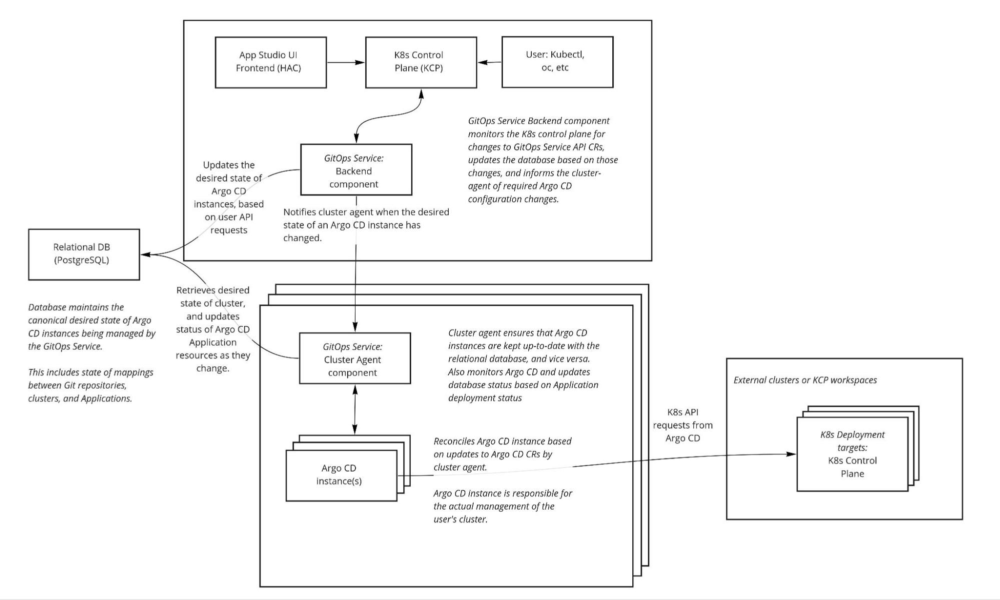
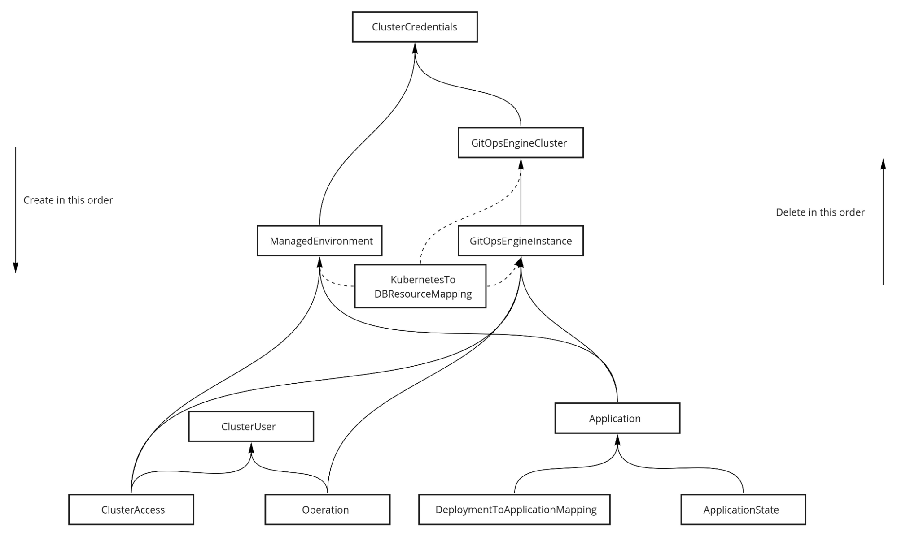
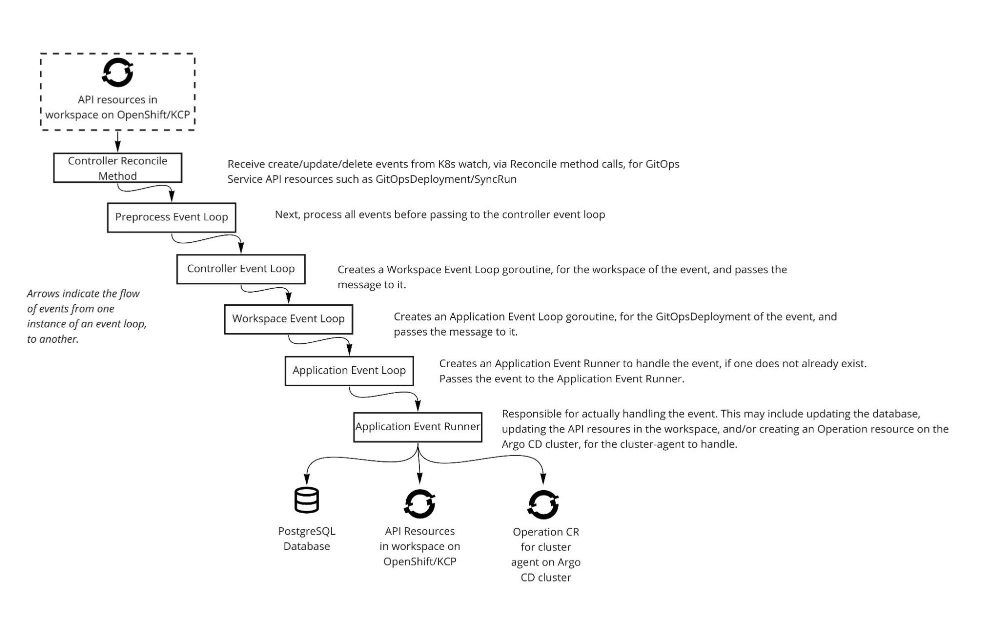

# Introduction to GitOps Service Code/Architecture

## Written by
- Jonathan West (@jgwest)
- Originally written November 4th, 2022

## The high level picture of the GitOps Service

GitOps Service API is similar to Argo CD Application API:  
[https://github.com/redhat-appstudio/managed-gitops/blob/main/docs/api.md\#gitopsdeployment](https://github.com/redhat-appstudio/managed-gitops/blob/main/docs/api.md#gitopsdeployment)

Ultimately the GitOps Service will:

* Watch for the GitOps Service API on user KCP workspace.  
* Process the event, and configure Argo CD to

For example:

* User creates a **GitOpsDeployment**  
  * GitOps Service: Create an Argo CD Application based on that, on the target Argo CD cluster  
* User creates a **ManagedEnvironment**  
  * GitOps Service: Create an Argo CD cluster secret based on that, on the target Argo CD cluster  
* User creates a **RepositoryCredential**  
  * GitOps Service: Create an Argo CD repository credential based on that, on the target Argo CD cluster

You can see how the GitOps Service API directly translates into the corresponding Argo CD API.

The advantage to the GitOps Service API is that:

* It is designed (better suited) for to deploying to KCP  
* We can modify it without getting the consent of upstream  
* We can use ‘better’ API design principles (CRs, rather than configmaps)  
* My thoughts are [here](../argo-cd-api-suitability-for-kcp-based-service.md)

## Which APIs are the Core GitOps API?

The Core GitOps APIs all begin with ‘*GitOpsDeployment\*’*. They are all under the ‘managed-gitops.redhat.com’ API group, and are defined in the backend-shared component.

All of the Core APIs which have a corresponding Argo CD equivalent:

* **GitOpsDeployment**  
  * Equivalent to Argo CD **Application**, and with a very similar API.  
* **GitOpsDeploymentRepositoryCredential**  
  * Equivalent to an Argo CD [repository secret](https://argo-cd.readthedocs.io/en/stable/operator-manual/declarative-setup/#repository-credentials)  
* **GitOpsDeploymentManagedEnvironment**  
  * Equivalent to an Argo CD [cluster secret](https://argo-cd.readthedocs.io/en/stable/operator-manual/declarative-setup/#clusters)  
* **GitOpsDeploymentSyncRun**  
  * Equivalent to running ‘argocd app sync (application name)’ on an Application

Internal Core APIs:

* These APIs are not exposed to the user. They are only used internally within the GitOps Service, to communicate between components.  
* **Operation**  
  * Used by the ‘backend’ component to notify the ‘cluster- agent’ of changes. 

Examples for all [APIs are here](https://github.com/redhat-appstudio/managed-gitops/blob/main/docs/api.md).

## Which are the AppStudio GitOps APIs?

These AppStudio GitOps API is built on top of the core APIs, to implement the AppStudio/HACBS application development model.

* The AppStudio GitOps controller creates and uses the Core GitOps APIs to implement the AppStudio Application/Component/Environment model.   
* For example: when a Environment is created, the Environment controller in appstudio-controller creates and configures a corresponding GitOpsDeploymentManaged

The AppStudio GitOps APIs are:

* **Environment**  
  * Defines a target deployment environment, such ‘dev’ or ‘staging’  
  * Environments correspond to KCP sub-workspaces, or remote clusters  
* **SnapshotEnvironmentBinding**  
  * Defines which Applications should be deployed to which environments, and what version of the application to deploy.  
* **Snapshot**  
  * Defines a set of container images that make up a particular version of an application  
* **PromotionRun**  
  * Used to promote versions of applications (snapshots) between environments. 

They are defined in the [application-api repository](https://github.com/redhat-appstudio/application-api/), and have the API group of ‘appstudio.redhat.com’.

Examples for all [APIs are here](https://github.com/redhat-appstudio/managed-gitops/blob/main/docs/api.md).

## Architecture Diagram

 

## What are the components of the GitOps Service?

We use a [Git mono-repo](https://github.com/redhat-appstudio/managed-gitops) to hold all of the components of the GitOps Service. Why? This allows us to make changes to all components across a single PR, and test those changes within that single PR.

**Core GitOps Service**:

* **backend**  
  * Watches KCP workspaces (via virtual workspaces) for API requests on the Core GitOps APIs, and updates the RDBMS database to reflect the user’s desired state   
* **cluster-agent**  
  * Singularly responsible for configuring/interfacing with Argo CD: ensures that Argo CD is up-to-date with desired state described in the database.  
* **backend-shared**  
  * Code that is shared between the two components, ‘backend’ and ‘cluster-agent’

**AppStudio GitOps Service**:

* **appstudio-controller**  
  * Watches KCP workspaces (via virtual workspaces) for AppStudio API requests on the AppStudio GItOps APIs, and updates Core GitOps APIs   
* **appstudio-shared**   
  * Where the AppStudio Environment APIs are defined  
  * BUT, this has now moved to [redhat-appstudio/application-api](https://github.com/redhat-appstudio/application-api)

**Tests and utilities:**

* **tests-e2e**: Where the E2E tests live for both the Core and AppStudio GitOps APIs  
* **utilities**: code for our database migration CI checks

## Differences between the GitOps Service controllers, and OpenShift GitOps Controller

**Must scale on public cloud, to a large number of (KCP) users**

The OpenShift GitOps controllers are scaled to the size of a single cluster: at most several hundred people might have access to it.

In contrast, the GitOps Service must scale to at least several thousand people, and potentially many more

* For example, the Red Hat Dev Sandbox has 3,055 active users, as of the last time I checked.

**Multithreaded**

The GitOps Service needs to support many simultaneous users across many different virtual clusters (KCP workspaces). This necessarily requires us to support many simultaneous user API requests across many different threads (goroutines).

**Guarding against malicious users / free-tier users with no identity verification:**

The GitOps Service needs to guard against malicious users. Theoretically, so does the OpenShift GitOps Controller, BUT, the GitOps Service must support fully unverified, pseudonymous users, such as those using the AppStudio/HACBS free compute tier.

* This is similar to how the Red Hat OpenShift Dev Sandbox supports pseudonymous users.   
* The Dev Sandbox team is constantly fighting against cryptominers 🙃

In contrast, most users of OpenShift GitOps would be employees of an organization, and thus are not anonymous and have a financial incentive not to become malicious (e.g. in order to keep their jobs).

**Sharding of K8s requests per workspace/namespace:**

Supporting multiple simultaneous users, and guarding against malicious users, requires us to have a system of sharding for incoming requests.

At present, requests are sharded per namespace of a KCP workspace.

* Each namespace, within each user’s KCP workspace, is handled by a different goroutine.

**Relational Database (postgresql):**  
   
In order to ensure scalability, data integrity, and reliability of the GitOps Service, an RDBMS (PostgreSQL) is used.

Reasons to store in an RDBMS, rather than as Kubernetes objects, include:

1. Once you have a lot of users, it's easier to scale up a managed RDBMS (such as Amazon RDS), than to scale up the etcd of an in-use cluster where your control plane lives  
2. Transactions, foreign keys, and strong typing: ensuring that the data for your service is always valid, consistent, and always moves between known good states.  
3. Arbitrary queries: ability to efficiently query the database (after adding the appropriate indices) across any set of fields.  
4. Avoid K8s resources limits (e.g. avoid maximum size resource limit of 1.5MB, IIRC)  
5. More generally: you can easily store 100k+ records in a database table, can you easily store 100k+ resources in a K8s namespace?  
6. From an architectural level, it means we don't need to share k8s cluster credentials of parent gitops services instance with child cluster-agent clusters, and vice versa. (we only need to share database credentials).

(You can also plug other stuff from the Postgresql/RDBMS ecosystem in, like streaming events via Debezium).

Will the persistence storage layer be the performance bottleneck of the GitOps Service? That's hard to predict, but IMHO an RDBMS is a more solid foundation for scaling a large amount of data than a K8s control plane. Many many many companies around the world are scaling using RDBMSes; not many are storing non-k8s application data in a K8s control plane.

**No Web-based User Interface (UI)**

The GitOps Service does not have its own UI. We instead rely on consuming services, such as AppStudio, to build a UI on top. 

## Relational Database

Schema can be found in ‘db-schema.sql’ at the root of the project. 

We use ‘go-migration’ to handle migration of one database version to another. The migrations are defined in ‘utilities/db-migration/migrations’. 

We use GitHub actions to ensure that the migrations are in sync with the db-schema.sql contents.

Tables in database:  

## Resource synchronization with operations

Ultimately, the goal of the GitOps Service is to create/modify/delete Argo CD Applications, and cluster/repository secrets.

In the GitOps Service, this functionality is split between two components: ‘backend’ and ‘cluster-agent’ 

The high-level interaction looks like this:

1) User creates/modifies deletes a GitOps Service API resource (for example, GitOpsDeployment)  
2) Event received by backend  
3) Backend updates database, and notifies cluster-agent of the DB update  
4) Cluster-agent sees the DB update, and updates Argo CD  
   * Creates an Argo CD Application, cluster secret, or repository secret.

KCP workspace \-\> backend \-\> db \-\> cluster agent \-\> argo cd

The same set of steps, with a bit more information.

1) A GitOpsDeployment is created in a user’s KCP workspace.  
2) The GitOps Service ‘backend’ controller receives the creation event from K8s.  
3) The GitOps Service updates the RDBMS based on the contents of the GitOpsDeployment   
   1) A row is added to the ‘Application’ table, with the contents of the GitOpsDeployment from step 1\.  
4) An Operation K8s resource is created, to inform the ‘cluster-agent’ component of the database update.  
5) The cluster-agent components sees the Operation, and reads the corresponding database entry  
   1) The cluster agent  
6) The cluster-agent creates an Argo CD Application based on contents of the Application row of the database from step 3\.

See also this [detailed diagram of step by step how this works](../presentations/gitops-service-GitOpsDeployment-creatio-steps.odp).

More details on operations in the Internal Architecture document, linked above.

## Multithreading

Much of the complexity of the ‘backend’ component of the codebase deals with the hard challenge of how to support many different users simultaneously, across many different goroutines, without hitting deadlocks, and race conditions.

Most controller-runtime based controllers are simple: they avoid this issue by only supporting a single active Reconcile() at a time (for example, the OpenShift GitOps controller, or the Argo CD ApplicationSet controller.).

* They are able to get away with only a single active Reconcile, because the custom resources (CRs) that they reconcile change infrequently.

OTOH, Argo CD is an example of a controller that supports multiple simultaneous user requests, and it does this by having a large number (\~25) mutexes sprinkled throughout the code. I speak from experience when I say this makes reasoning about controller concurrency challenging, at times.

But rather than using mutexes, we use channels: we follow the Go best practice of [sharing data via message passing (channels), not via locks on shared memory (mutexes)](https://go.dev/blog/codelab-share)

## Multithreading: ‘Event Loop’ Pattern

For this we use ‘event loops’ (also known as [actors](https://en.wikipedia.org/wiki/Actor_model), or perhaps ‘in-process’ microservices), which listen for messages on go channels from other parts of the program.

* This is similar to how Argo CD is partitioned into multiple separate microservices (repo-server, application-controller, etc), but, the GitOps Services are much smaller and  

This makes writing multithreaded code less painful, because:

* Messages passed between event loops are immutable.   
* Data within an event loop is not shared outside of that event loop.   
* A single goroutine is responsible for processing messages on each event loop.

These factors mean that mutexes (or other locks) are not needed.

Event Loops:

* **Controller**  
  * Reconcile function of controller is called on any create/modification/delete/watch events for an API resource.  
* **Preprocess Event Loop**  
  * Receive events from controller, pass them to controller event loop.   
  * Responsible for processing the events before passing them to the next event loop.  
* **Controller Event Loop**  
  * Receive events from preprocess event loop  
  * Starts a new instance of a workspace event loop for every namespace of a workspace.  
  * Pass events to that workspace event loop.  
* **Workspace Event Loop:**  
  * Receives event from controller event loop  
  * Starts a new instance of application event loop for every GitOpsDeployment name/namespace combination  
  * Passes events to that application event loop  
* **Application Event Loop**: Receive events for GitOpsDeployments/GitOpsDeploymentSyncRuns  
  * Receives events from Workspace Event Loop  
  * Calls application\_event\_runner\_(deployment/syncrun) with the event/

* **Workspace Resource Event Loop**  
  * workspaceResourceEventLoop is responsible for handling events for API-namespaced-scoped resources, like events for RepositoryCredentials resources.  
  *   
* **Shared Resource Event Loop**  
  * The goal of the shared resource event loop is to ensure that API-namespace-scoped resources are only created from a single thread, preventing concurrent goroutines from stepping on each other's toes.

So you may be asking again, why all these event loops? Well this allows us to ensure that we can handle requests from a large number of users in a scalable manner, without data races or race conditions, and with protection from malicious users.

## But: you mostly don’t have to deal with the logic of most of these event loops

The vast majority of work is done in application event runner, and in the shared resource loop.

So for the most part it’s only necessary to know where particular resources are handled. It’s often enough just to know this:

* **GitOpsDeployment**: handled in ‘application\_event\_runner\_deployments.go’  
* **GitOpsDeploymentSyncRun**: handled in ‘application\_event\_runner\_syncruns.go’  
* **GitOpsDeploymentRepositoryCredentials**: handed in shared resource loop  
* **GitOpsDeploymentManagedEnvironment**: handled in ‘sharedresourceloop\_managedenv.go’

## More details and advanced topics

For more details on what was discussed today, and some more advanced topics, check out the [AppStudio GitOps Internal Architecture document](../gitops-service-internal-architecture-appstudio/internal-architecture.md), in our GitOps Service Google Drive folder.
