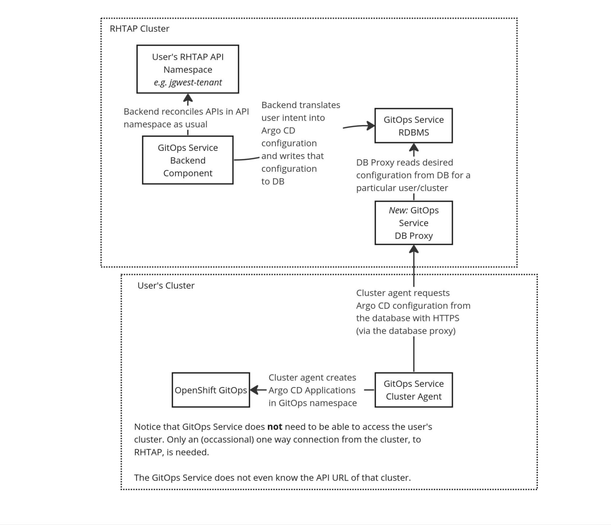

# GitOps Service Pull-model using cluster-agent component

So when the GitOps Service architecture was created, this is how I envisaged we would implement this requirement.

### Written by
- Jonathan West (@jgwest)
- Originally written in June 7, 2023.


# How it looks from the API perspective

**1\) On a cluster that you want to deploy to, using GitOps Service:**


```bash
# A) Install openshift gitops onto cluster, in openshift-gitops namespace (default)

# B) install cluster-agent component onto cluster
kubectl create ns gitops-service-agent
kubectl apply -n gitops-service-agent -f cluster-agent-deployment.yaml

# C) create a Secret in 'gitops-service-agent' Namespace, to allow the cluster-agent to register the cluster with the backend service
```

```yaml
kind: Secret
metadata:
  name: my-internal-cluster-secret
  namespace: gitops-service-agent  
data:
  registrationToken: (generated token)
```

**2\) In the API namespace, create a ManagedEnvironment targeting that cluster. This step is new for this use case.**

```yaml
kind: ManagedEnvironment
metadata:
  name: my-internal-cluster
  namespace: jgwest-tenant
spec:

  disconnectedCluster: # new field
    gitopsEngineNamespace: openshift-gitops
    clusterRegistrationSecret: my-internal-cluster-secret
```


And create a Secret with the same matching token as on the target cluster.

```yaml
kind: Secret
metadata:
  name: my-internal-cluster-secret
  namespace: gitops-service-agent  
data:
  registrationToken: (generated token that matches the token contents on the cluster)
```

3\) Now, if you want to deploy to that cluster from RHTAP, you do:

```yaml
kind: GitOpsDeployment
metadata:
  name: my-app
  namespace: jgwest-tenant

spec:
  source:
    repoURL: http://github.com/jgwest/my-app
    path: ./
    
  destination:
    namespace: jgwest
    environment: my-internal-cluster # reference to ManagedEnv, above
```

And that's it\!

Notice that you **never** gave cluster credentials for your external cluster, or even provided an API URL for the cluster\! 

* These are not needed in this scenario. All that is needed is for the target cluster to be able to connect back to RHTAP via HTTPS.  
* No secure tunnel or VPN needed.

# How does it work?

## Architecture Diagram



*New*: Cluster agent on user's cluster:

The existing GitOps Service cluster-agent is installed on the user's cluster. The cluster-agent watches/polls the DB proxy in order to know how to configure the Argo CD instance installed on the cluster.

The existing cluster-agent component of GitOps Service literally already does what we need it to: it reads from a database in real time, and configures Argo CD using the contents of that database.

All that is required is one-way communication from the user’s cluster back to the service. No secure tunnel or firewall hole punching is needed.

* Note: This doesn't support 'always, 100% fully disconnected' clusters (but, by definition, you can't use an external managed service to manage an 'always, fully disconnected' cluster :P. It will work if it is only sometimes disconnected, e.g. the edge case)

The cluster-agent component on the customer's customer periodically polls the backend component (or uses a websocket), via a database proxy.

* The database proxy is a lightweight  
* The entire goal of the database-proxy is to only return results from the RDBMS that are related to the requesting cluster.  
* The registrationToken is how the backend service knows which cluster is involved.

So, for example, if the cluster-agent wanted to know what Argo CD Applications should be configured in OpenShift GitOps, it would send an API request to db-proxy:

**(base url http://gitops-service-db-proxy.(...).openshiftapps.com)**

Request: GET **/api/v1/cluster/(*cluster registration token*)/applications**  
Response: (JSON representation of Application row of database, containing the expected)

Upon receiving the request, the backend proxy would query the RDBMS to find the ClusterUser that corresponds to the provided cluster registration token, query the database, and return the expected results.

*New*: Cluster agent on user's cluster:

The DB proxy is a lightweight REST/GRPC service, which returns results directly from the database.

All the proxy does is this:

1. Listen for HTTP requests from the external cluster-agent (on the user's cluster) for what the expected state of Application rows on the cluster is.  
2. Retrieve those from the database (but only results for that user)  
3. Write those back as an HTTP response.

The proxy is needed only to ensure that the results that are returned are scoped to a particular user/cluster. (For example, we wouldn't need the database proxy if we let users connect directly to our RDBMS).

# GitOps Service Changes required to implement this feature

The advantage to this solution is it requires very little modification to the existing codebase, since this was one of the envisaged purposes of the cluster-agent component.

(I was actually in the middle of prototyping this feature on my own time, because it would be fairly quick to implement, and so I could use it to deploy to the Raspberry Pi inside my home network).

The following changes to the GitOps Service are required to support this feature:

* Currently we use Operation CR – from backend to cluster agent – to notify cluster-agent of database changes. We would need to switch to using postgresql notifications instead of Operation CR.   
  * BUT, we should do this anyways, and I have wanted to do this since the beginning..  
* Implement the database proxy and database proxy client, to allow cluster-agent to communicate via REST proxy to the database   
  * I'm actually half way through prototyping this using go-resty; it's pretty simple.  
* Update cluster-agent to access the database via the database proxy, rather than connecting to the database directly.  
  * I'm actually half way through prototyping this using go-resty; it's pretty simple.  
* Update backend component to support a remote non-accessible cluster as a ManagedEnvironment (add a new field to ManagedEnvironment table, and update the logic)  
* Test it.
