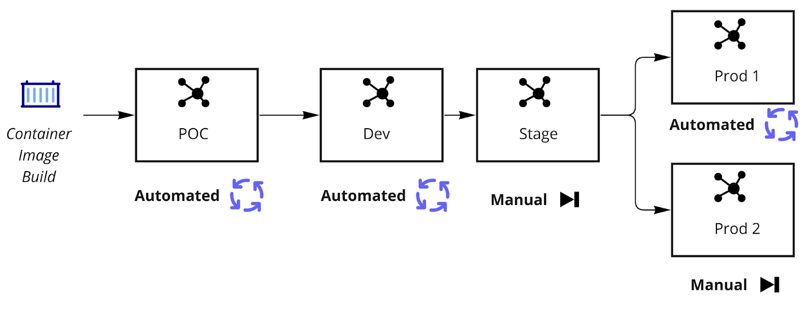
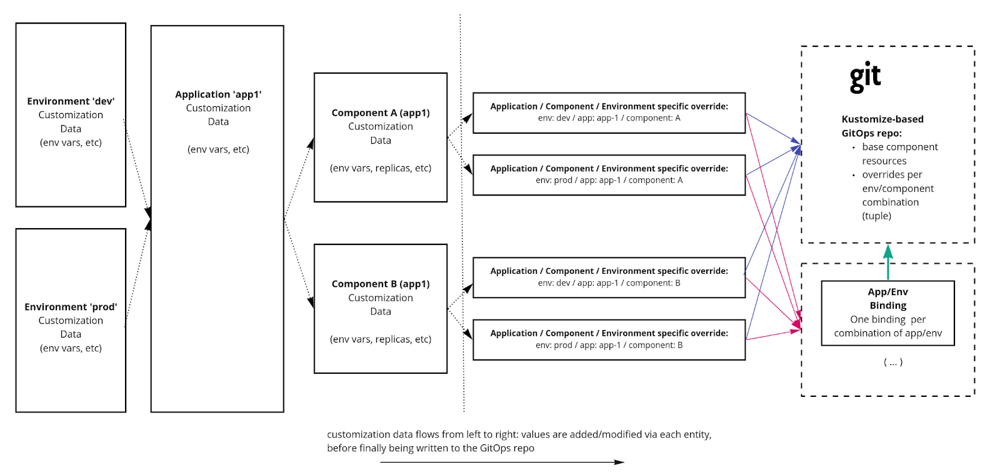
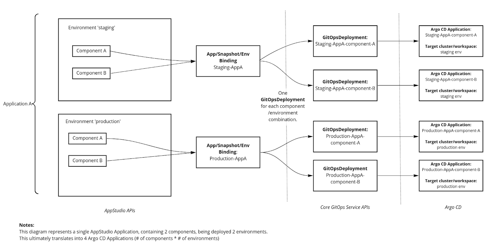

# **Environment API v3: Component-scoped API with first-class Snapshot support**<a id="docs-internal-guid-a7b21a55-7fff-32ce-df1d-117a5f5b5534"></a>

Written by Jonathan West (@jgwest), based on feedback, comments, and discussions with Red Hat AppStudio/HACBS teams.

## **Diff from v3 proposal**

- Remove Application\* prefix from resources (for example, ApplicationSnapshot is now just Snapshot)

- Clean up old/outdated text.

- Ultimately, the canonical representation of all APIs described here will be the [appstudio-shared component](https://github.com/redhat-appstudio/managed-gitops/tree/main/appstudio-shared) in the GitOps Service repository.


## **Diff from v2 proposal**

- **Major differences:**

  - New concept of **Snapshots** and new API resource **Snapshot**

  - Tuple has been renamed to **SnapshotEnvironmentBinding**

    - **Note:** Henceforth I will use the term **Binding** for this.

  - Cardinality of the Binding/Tuple has changed: 

    - It is now 1 per (Environment, Application) combination, rather than 1 per (Environment, Application, Component) combination.

    - Many structural changes to tuple to account for above.

  - Allow HACBS (or other consumers) to override promotion controller promotion (to extend/replace/disable the promotion process) ****

    - See Environment’s ‘_.spec.deploymentController_’ and ‘_.spec.deploymentStrategy_’

    - Allow HACBS to write their own promotion controller, and a way to indicate within the Application resource that HACBS’ controller is responsible for promotion (and thus the AppStudio promotion controller would be a no-op).

  - New resources: **PromotionRun** for driving automatic/manual promotion, to be primarily reconciled by the GitOps Service

    - These resources are responsible for managing the promotion process, and tracking the status.

- **Minor differences:**

  - Under **Environment** resource, ‘.spec.previousEnvironment’ renamed to ‘.spec.parentEnvironment’ 

  - More explicit descriptions of the promotion process.


## **Document Goals**

- This doesn’t prescribe a particular UI representation of these concepts, rather only how the components will communicate with each at the API level. (But of course, hopefully one should straightforwardly translate into the other!)

* Develop an MVP API, to serve as basis for M5+ development

  - Some details will ultimately be left TBD, but their scope should only affect that specific subset of the API (for example, cluster details)

  - Allow folks to start implementing MVP, to allow component owners to better understand how this will interact with their existing component flows

    - Inevitably this will bring focus to more changes that are required.

    - Individual component owners should feel free to poke logic holes in proposal items that seem counter to individual requirements of their component.

- Provide concrete API examples/behaviour of abstract concepts discussed in journey 10 doc

- Foundation for discussing additional requirements outside of the journey 10 document above (for example, HACBS environment requirements)

- Incorporate comments from the first draft, second draft, and HACBS comments on second draft.

- Clear the slate from v2 for the next set of iterative comments 

**Valid questions raised in previous comments, and valid problems to solve, but which IMHO are out of scope for the MVP doc (we can iterate on these post MVP)**:

- How to GC old snapshots

- How to archive old snapshots for longer-term storage

- HACBS’ global candidate list 

  - This was touched on in the HACBS doc, but seems like this is a bigger concept that doesn't touch the Environments API at this stage (confirmed by Ralph)

- UI/UX Design (but of course we need to ensure that the API easily translates to whatever we decide here)

- Cluster credentials API design


## **New concept: Snapshots**

The concept of **Snapshots** was first discussed during the April 6th, 2022 Architecture call, where the v2 current document was discussed. 

A snapshot is:

- A set of (Component, Container images) pairs, that describe which Components should be deployed with what container images.

- Additional artifacts/metadata not directly related to deployment, for example:

  - Whether a snapshot has passed QE

  - What source code commit the particular build images represent

  - (etc)

- See below for a concrete example of a Snapshot.


## **Snapshot-native API: snapshots as first class API**

As proposed by HACBS: replacing the tuple-based design in v2 (where, in v2, each application-component-environment would have had its own **ApplicationComponentEnvironmentTuple** resource) with a single **SnapshotEnvironmentBinding** resource, describing the full application, alongside a snapshot for the particular component images.

As mentioned above, this is my personal recommendation. The rest of this document goes into exploring this option.

**Pseudo-YAML (non-exhaustive list of fields):**

```yaml
SnapshotEnvironmentBinding CR:
  env: staging
  application: my app
  snapshot: (name of snapshot, reference to below)

Snapshot CR:
- component A
  image: (...)
- component B
  image: (...)
```

In this design, a Snapshot is required in order to promote/deploy to an Environment, via a Binding.


### This approach uses immutable container image artifacts, which come with tradeoffs

With Snapshots (or any immutable deployment artifact), there are advantages and disadvantages, inherent to that immutability.

**Advantage: The relationship between a specific set of images is easier to track within the API.**

With the past v2 Tuple-style API, it was more challenging to track what sets of component images were deployed together.

Now, sets of deployed container images are a first-class resource, within the Snapshot CR.

Thus you can look at current and past snapshots, and be able to reason about the history/flow of deployment artifacts within the Application. (e.g. we could record any time the snapshot field of the Binding changed, and use that to see that the application deployment went from, snapshot A -> snapshot B -> snapshot C, etc).

Ensures that Application/Environment combinations always reconcile from one consistent state to another (At a high level, at least. At a lower level, ultimately Kubernetes/Argo CD may still take some time to deploy resources.)

Since these resources are immutable, we can rely on them to consistently reflect a specific global Application deployment, and reference this state via other mechanisms (the Binding resource, but also for archival purposes to long term storage).

Ensuring that an API provides a solid mental model of its behaviour is important: I believe the concept/analogy of a Snapshot is an excellent tool for allowing users to reason about deployment/promotion behaviour, and we’ve had comments in architecture meetings that tend to support this.

**Disadvantage: The primary disadvantage to the Snapshot approach is that it will potentially cause many snapshots to be created (one for each time an individual component needs to be updated).**

The algorithm that would likely be used to create Snapshots would be (non-HACBS promotion controller):

- When a component build completes, create a new Snapshot, and update the Binding.

Here’s an example of how that would look.

Imagine we have an Application with 3 components: componentA, componentB, componentC

**Steps: snapshots created on component build:**

1. build is triggered on all components

2. componentA build completes, a new snapshot #1 is created and set on the Binding

3. componentB build completes, a new snapshot #2 is created and set on the Binding

4. componentC build completes, a new snapshot #3 is created and set on the Binding

_Mitigation strategy_: Could we wait for all components to build? Potentially, but this may come with a fair bit of complexity, depending on implementation details. What if one component takes a lot longer than the others (especially since these are Docker builds, which can take time)?

- As noted by Elson and Alexey, this may not be worth it due to:

  - Alexey notes that ‘we lose independence between component lifecycles (one component lifecycle/build now depends on others), \[...] which by itself creates many related issues.”

  - Complexity: significantly increases the complexity of required logic, and the number of moving parts to keep track of.

  - Elson also notes “Also, in the early application development phase, users may be developing frontend and backend components in an application. They may still want to deploy the application in "dev" environment to test things out in the backend component even though the frontend component may still have errors. If we wait for all components to be built successfully, the user can't deploy in that situation.”

  - Elson and Alexey thus prefer not waiting. Ralph generally preferred waiting, but it did not sound like a deal breaker for him based on the following conversations: "I think HAS should be modified to watch for updates to the spec.build.containerImage field. If it sees that all Components for an Application have a containerImage set, but there is no deployment yet to the PoC/dev environment - then HAS should create a snapshot from the set of \`spec.build.containerImage\` fields across all components for that Application and attach that new snapshot to the tuple for PoC/dev environment. This would in turn trigger HAS to update the GitOps repo."


### Tradeoff: snapshots may not necessarily contain ALL Of the components of an application, on initial creation of an Application (e.g. early in the Application’s lifecycle)

When an Application is first created, the components will start building, and their builds will complete at different times.

Would look like this:

Imagine we have three components: Component A, Component B, Component C

**Events:**

1. Application/Component resources are created and components A/B/C start building.

2. Component A build completes.

3. Snapshot #1 is created:

   -  **\[ (Component A, image:component-a-1) ]**

4. Binding is updated.

5. Component B build completes.

6. Snapshot #2 is created: 

   - **\[ (Component A, image:component-a-1), (Component B, image:component-b-1)  ]**

7. Binding is updated.

8. Component C build completes.

9. Snapshot #3 is created: 

   - **\[ (Component A, image:component-a-1), (Component B, image:component-b-1), (Component C, image:component-c-1)  ]**

10. Binding is updated.


## **Snapshot-native API**

### SnapshotEnvironmentBinding:

The **SnapshotEnvironmentBinding** resource specifies the deployment relationship between (a single application, single environment, and a single snapshot), within a namespace. 

- **Note**: Unlike the v2 doc, a Binding describes the deployment of **all** components of an application. In v2, a Tuple only described a single deployment.

This binding also allows customization of environment variables/replicas/etc on a per environment, per component basis. _Example_: I want 1 replica when component A is running on dev, and 3 replicas when component B is running on prod.

Does not currently prescribe any additional behaviour beyond describing this relationship, and providing a mechanism for resource customization.

_AppStudio subsystem relationships:_

- HAC: 

  - Binding is created by HAC, when a user expresses their deployment intent, e.g. “I want to deploy application A to staging”.

  - Updates the component ‘configuration’ field when users add env vars, replica sets, etc, to a (component, environment).

- HAS: 

  - Watch the Binding for changes (snapshots change, component configuration changes), and regenerate the GitOps repository based on those latest changes.

  - Update the ‘gitopsRepository’ field to point to the URL/path of the component within the repository.

- GitOps Service: 

  - Updates the ‘status’ field to point to the current set of GitOpsDeployments. Watches the Binding for changes

  - Updates the ‘snapshot’ field as part of the promotion resource (via PromotionRun resources/controllers)

  - Create a GitOpsDeployment resource for each corresponding component in the Binding.

```yaml
apiVersion: appstudio.redhat.com/v1alpha1
kind: SnapshotEnvironmentBinding 🆕

metadata:
  name: appA-staging-binding # (app name)-(env name)-binding

  # labels are immutable.
  labels: # These labels are recommended, so that we can use label selectors to easily find all apps/envs, without needing to do a full namespace list.
    appstudio.application: appA # Should always match application value below
    appstudio.environment: staging # Should always match env value below

spec:

  # application/environment are immutable.
  application: appA # ref to k8s Application resource name, in namespace
  environment: staging # ref to k8s Environment resource name, in namespace

  # snapshot field is mutable
  snapshot: (reference to application snapshot)

  # individual component configuration
  # configuration values are mutable
  components:
    - name: (reference to component)

      # snapshots may also override these values.
      # unclear if the 'configuration' field is necessary if we have a snapshot.
      configuration:
        # Note: Non-exhaustive list.
        # containerImage should be configured in a snapshot.
        # targetPort: (...) # Open question: Alexey doesn't think this should be configurable, so I’ve left it out for now until we have a specific request.
        resources:
          limits: # (...)
          request: # (...)
        env:
          - name: (...)
            value: (...)
        replicas: (...)

status:
  components:
  # Where the Kubernetes resources for the component are defined.

  # re: mutability of 'gitOpsRepository' field, it is mutable:
  # HAS to watch for the creation of the Binding, and once created, it would fill in this field with the values.
    - name: (reference to component)
      gitOpsRepository:
      # GitOps URL for application
      # e.g. The git repository that contains the K8s resources to deployment for the application/component
      url: "https://github.com/redhat-appstudio/gitops-repository-template"
      branch: main
      # Path to a directory in the GitOps repo, containing a kustomization.yaml
# NOTE: Each component-env combination must have it's own separate path
      path: /components/(component name)/overlays/(environment name)
      generatedResources:
        - deployment-patch.yaml


  gitopsRepoConditions:
    - lastTransitionTime: "2022-06-09T21:56:19Z"
      message: GitOps repo has been successfully refreshed
      reason: OK
      status: True
      type: Refreshed


  gitopsDeployments:
    - componentName: (...)
      gitopsDeployment: (...)
      # Each component would have a corresponding GitOpsDeployment, and the reference to the name of that GitOps deployment would be here. Health/sync status can be found here.
# (...)
```


### Snapshot:

Immutable, read-only once created.

**Description:**

The primary purpose of a Snapshot is to define a set of container images (one for each Component of an Application), which together represent a specific version of an Application.

- A Snapshot should contain one container image per component of the Application.

- Example:

  - If an Application has 3 Components:

    - frontend, backend, database

  - The Snapshot should have a container image for each component

    - jgwest/app-frontend:latest

    - jgwest/app-backend:latest

    - postgresql/postgresql:latest

Once a Snapshot is created, it can be set in the **.spec.snapshot** field of **SnapshotEnvironmentBinding**, which instructs the GitOps Service (and HAS) to deploy the container images described in the Snapshot to the target Environment.

Snapshot is also used for promotion: Snapshots are the primary field that is changed during the promotion process. 

- Promotions from one Environment to another are handled by changing the .spec.snapshot field of SnapshotEnvironmentBinding.

  - Example

    - You want to promote Snapshot ‘snapshot-v2’ 

    - You want to promote Snapshot from Environment ‘dev’ to Environment ‘staging’

    - You create (or update) the SnapshotEnvironmentBinding of the ‘staging’ Environment: you set the .spec.snapshot field to ‘snapshot-v2’

    - This will cause GitOps Service (and HAS) to deploy the new Snapshot version to the staging environment.

As requested by (IIRC) HACBS (but also generally useful for other use cases), Snapshots may also contain additional artifacts, such as the results of testing a particular Snapshot (e.g. '9/10 unit tests passed on Snapshot v2‘'). See the \`.spec.artifacts\` field of Snapshots, but the specifics of this were intentionally not defined (they are placeholder), as of this writing. 

The lifecycle of snapshots, how to handle 'How to GC old snapshots' and 'How to archive old snapshots for longer-term storage' were explicit non-goals of the API doc. It is up to consumers of the API to define their requirements here.

_AppStudio Component Relationship:_

- HAC: 

  - Users may select a particular snapshot that they want to deploy to a particular environment.

  - HAC would be responsible for creating the snapshot, and setting the snapshot on the target binding.

- HAS: 

  - (Build service) A new Snapshot is created whenever a container build succeeds. 

  - The contents of the Snapshot would be used to regenerate the GitOps repository (based on the Binding, which references the Snapshot)

```yaml
apiVersion: appstudio.redhat.com/v1alpha1
kind: Snapshot 🆕


metadata:
  name: my-snapshot


spec:
  displayName: "My known good staging snapshot" # Human-readable, set by user
  displayDescription: "The best we've had so far!" # Human-readable, set by user

  components:
    - name: componentA
      containerImage: (...)

  artifacts: 	 
    # Placeholder section for 'artifact links' we want to maintain to other AppStudio resources
    #
    # For example: here I'm imagining we might want to keep track of container image <=> (source code repo, commit sha) links,
    # which might be useful to present to the user within a snapshot ui.


    unstableFields: # PLACEHOLDER: don’t rely on these.

      # build artifacts
      build:
        # for each container image contained within components, here is the provenance
        - containerImage: # sha of image
          sourceRepository:
          url: https://github.com/my-org/my-source-repo
          commitID: # commit id upon which the source code was built

      # misc generic attributes
      attributes:
        - qeApproved # An idea suggested at the meeting: ability for a user in QE role to 'bless' snapshots. We can later expand on this with specific requirements
```
|                                                                                       
### Relationship between Git Commit and Snapshot

Since the GitOps repository contains K8s resource data for multiple components and environments simultaneously, one commit represents the state of all of these resources.

Subsequent commits may likewise mutate the state of one or more components or environments at once.

The conceptual relationships between Git commits and snapshots look like this:

**git commit id -> list of snapshot ids used to generate that git commit:**

- Each commit of a GitOps repository contains k8s resources generated using \[1, n] snapshots, where n is the number of environments.

  - Example: github.com/jgwest/application1

    - Commit 123:

      - /components/componentA/overlays/staging:

        - Kustomize overlay sets container image of ‘componentA’ to the image from snapshot ‘application1-v2’

      - /components/componentA/overlays/prod:

        - Kustomize overlay sets container image of ‘component A’ to the image from  snapshot ‘application1-v1’

    - Commit 123 thus used multiple snapshots to generate its contents.

- The K8s resources contained within a Git repository were thus generated using potentially many multiple snapshots: generated using at least one snapshot, and at most one snapshot per environment.

**snapshot id -> list of git commits that the snapshot was (historically) used to generate that commit:**

- A snapshot can be used as input to generate multiple historical commits in the GitOps repository

  - Example: 

    - Imagine that 5 changes were made to the environment variables of an Application (causing the GitOps repository to be regenerated), but the Snapshot (container images) of the components were not changed. 

    - Thus, the same snapshot was used to generate for each of those 5 commits (since the Snapshot only contains a container image field, and the container image was not changed).

    - commit 1: app1 env vars updated. resources generated based on snapshot1

    - commit 2: app1 env vars updated again. Resources still generated based on snapshot1

    - commit 3: app1 env vars updated again. resources still generated based on snapshot1

    - commit 4: app1 env vars updated again. resources still generated based on snapshot1

    - commit 5: app1 env vars updated again. resources still generated based on snapshot1

    - Since the snapshot (component’s container images) were not changed, commit 1 to commit 5 will all be based on snapshot1.

- The list of git commits (which were generated from a specific snapshot) may contain \[0, n] values, where n is the number of commits in the gitops repository in which the snapshot values (component container images) were consumed.

- A snapshot is orphaned if it was not used to generate any commits on a Git repository.

The HAS component would be privy to these relationships, since it is responsible for knowing which snapshots were used to generate which Git commits. I imagine these could be made available in some form, but it is outside the scope of this document.


## **Environment APIs**

### **Sample AppStudio Application**

```yaml
apiVersion: appstudio.redhat.com/v1alpha1
kind: Application
metadata:
  name: appA
spec:
  appModelRepository:
    url: "(...)"
  displayName: appA
  gitOpsRepository:
    url: "(...)"

  # Based on conversations during architecture meetings, I’ve removed deploymentStrategy from Application. If/when this requirement solidifies, it should be straightforward to add back.
  # deploymentStrategy will only be at the environment level, as of this writing.

  status:
    conditions:
    - lastTransitionTime: "2022-03-17T15:42:00Z"
      message: Application has been successfully created
      reason: OK
      status: "True"
      type: Created
    devfile: |
      metadata:
        attributes:
          appModelRepository.url: https://github.com/redhat-appstudio-appdata/purple-mermaid-app-contribute-wind
          gitOpsRepository.url: https://github.com/redhat-appstudio-appdata/purple-mermaid-app-contribute-wind
        name: Purple Mermaid app
      projects:
      - git:
          remotes:
            origin: https://github.com/nodeshift-starters/devfile-sample.git
        name: basic-node-js
      schemaVersion: 2.1.0
```

### **Sample AppStudio Component**

```yaml
apiVersion: appstudio.redhat.com/v1alpha1
kind: Component
metadata:
  name: basic-node-js
  namespace: my-namespace
spec:
  application: purple-mermaid-app
  build:
    containerImage: ""
  componentName: basic-node-js
  resources:
    requests:
      cpu: 200m
      memory: 200Mi
  replicas: 1
  source:
    git:
      url: https://github.com/nodeshift-starters/devfile-sample.git
  status:
    conditions:
    - lastTransitionTime: "2022-03-30T13:17:54Z"
      message: Component has been successfully created
      reason: OK
      status: "True"
      type: Created


    # E.g. built image should be applied to the first environment (the one with no prevs) of an Application.
    # Ralph Bean et al notes that there is a race condition if this value is used for promotion to any environment other than the first.
    # TBD: Rename this field to most recently ‘recentContainerImageBuild’? 
    # The _actual_ container image deployed for the component would be defined in the snapshot, not here.
    containerImage: quay.io/redhat-appstudio/user-workload:basic-node-js
    devfile: |
      # (...)


    gitops:
      repositoryURL: https://github.com/redhat-appstudio-appdata/purple-mermaid-app-contribute-wind
    webhook: elbasic-node-js.apps.appstudio-stage.x99m.p1.openshiftapps.com
```


### Sample AppStudio Environment

Environment CR is created/modified/deleted by HAC. HAS to use some of these values to populate GitOps repo. GitOpsService to use some of these values (cluster credentials, deployment\* fields) to configure Argo CD to deploy to the target cluster.

_AppStudio Component Relationship:_

- **HAC**: Any environment-specific environment variables should live here.

- **GitOps Service:** Create a corresponding **GitOpsDeploymentManagedEnvironment** resource for each Environment, including the cluster credentials.


```yaml
apiVersion: appstudio.redhat.com/v1alpha1
kind: Environment
metadata:
  name: prod
spec:
  type: poc | non-poc # as requested by Alexey in first draft doc, details TBD: but some way to designate a cluster as poc (which has different behavior from non-poc, it sounds like)
  displayName: “Production for Team A”  # as requested in first draft doc


  deploymentStrategy: Manual / AppStudioAutomated
  # - AppStudioAutomated (appstudio-only): 
  #   - If this Environment has a parent: a successful deployment/configuration change to a parent environment will cause this Environment to be deployed to.
  #   - No parent: A successful component container built by the build service or configuration change will cause this environment to be deployed to.
  # - Manual: 
  #   - Parent: A successful deployment/config change to a parent environment will NOT cause this environment to be deployed to. (though the gitops repo may still be updated)
  #   - No Parent: A successful container built by the build service will not cause this environment to be deployed to. (Though the gitops repo may still be updated)
 
  parentEnvironment: staging  # replacement for the ‘order’ concept; instead an environment specifies the previous promotion staging. (Renamed from prevEnvironment in v2. 🆕)

  tags:
    - prod # (concept of tags, from journey)


  clusterCredentials:
    apiServerURL: (some k8s api url)
    credentials: (secret containing service account token to connect to the cluster api)

 (reference to cluster from cluster service, details TBD)


  configuration:     
    # I have only included env here, because all other fields don't make sense (port, replicas, etc) for this environment CR, which is shared between Applications.
    env: # env vars shared between all applications deploying to Env
      - name: (...)
        value: (...)
  # (...)
  ```


### Relationships


Here a single Application (appA), contains a single component (component A).

Two versions of the appA’s component componentA exist:

- Container image: componentA:version1

- Container image: componentA:version 2

Version 2 of the component is deployed to dev, via the appA-dev **Binding**, which points to the version 2 **Snapshot**, which points to the ‘componentA:v2’ _container image_.

Version 1 of the component is deployed to staging and prod, via the appA-staging and appA-prod **Bindings**, which point to version 2 of the snapshot, which points to the ‘component A:v1’ container image.


## **Promotion (non-HACBS workflow)**

**Note**: HACBS have said they would like to define and drive their own mechanism for promotion: 

- “In HACBS we intend to automate promotion via functional testing pipelines (described below). In our case, all Environments should have their deploymentStrategy set to “manual” so that the gitops promotion mechanism doesn’t interfere with the validation pipelines we’re building.”

- This section is therefore only focused on non-HACBS workflow.

Promotion refers to the movement of container image values of components, between environments, along a prescribed promotion graph (e.g. ‘dev’ env -> ‘staging’ env -> ‘prod’ env).

_Promotion is a four-step process:_

- **Create a new Snapshot containing one or more new containerImages (one container image for each component), if one doesn’t already exist.**

  - Snapshot is either created manually by the user via UI (for example, as part of a UI action), or automatically based on an actionable event (new build of container image)

  - **Note**: I _believe_ that container image is the only customization value we want to move between bindings, as part of promotion. (e.g. we don’t want staging-only env vars to be promoted into production, or # of productions replicas to be overwritten)

    - My suggestion: start implementing an MVP that **only** has the ability to promote container images between environments, and then go from there re: other values (env vars, replicas, etc) to promote.

    - This will allow us to better understand this workflow.

- **Update the SnapshotEnvironmentBinding to reference the new Snapshot**

  - The **Binding** resource is what indicates what Snapshot should be deployed to which environment, for an Application.

  - Update the Binding for the target environment (the promotion target) with the new snapshot

- **Regenerate the GitOps repository based on the new Binding**

  - HAS watches Binding resources and updates the GitOps repository based on changes

  - For example: UI adds an env var to a Binding, HAS ensures the env var is set in the GitOps Repository. UI adds a new snapshot to Binding, HAS regenerates the container images of changed resources.

- **GitOps service deploys the new contents of the GitOps repository (either via a manual sync operation, or automated sync)**

  - GitOps Service ensures there is a GitOpsDeployment corresponding to each component defined within the Binding

  - Argo CD watches GitOps repository for change, and deploys


### Who should create/update the SnapshotEnvironmentBinding?

_For HACBS_: HACBS controllers would be creating the SnapshotEnvironmentBinding resources. They don't plan to use the PromotionRun controller; they will implement their own (I think the integration service does this).

_For AppStudio:_

(TL;DR: let's start with the GitOps Service creating Bindings via the PromotionRun controller, and see if that works for everyone.)

There's a few ways we can do this. For the sake of reducing initial complexity, and to help us discover future requirements/expected behaviours here, let's do this:

I (@Jonathan West) think the GitOps Service's **PromotionRun** controller can handle creation of **SnapshotEnvironmentBindings**. The PromotionRun controller can automatically create the SnapshotEnvironmentBinding whenever a PromotionRun is created. Thus, whenever the Binding is first used, it is created.

For example:

```yaml
kind: PromotionRun
spec:
  snapshot: (some snapshot)
  application: appA
  manualPromotion:
    environment: env1
```
would automatically create a **SnapshotEnvironmentBinding** targeting that snapshot to that Application/Environment (with default replicas/env var values).

```yaml
kind: SnapshotEnvironmentBinding
spec:
  application: appA
  environment: env1
  snapshot: (snapshot from above)
  component: (components from Application CR)
```


If a SnapshotEnvironmentBinding already exists for that Application, it would use that existing version.

(We may also discover some use cases where the UI needs to create it, first, but that's fine: in that case the PromotionRun controller will just use that object).


### Does that mean that the user needs to manually promote (via the UI) Snapshots to the dev environment?

(TL;DR: As of this writing (October 2022), yes, but in the medium term, no. Until we have automated promotion supported in GitOps Service, the user should select a snapshot to promote in the UI, which should create a manual PromotionRun. The GitOps Service will then handle the PromotionRun.)

So here's the full picture, as I (@Jonathan West) see it:

The 'dev' environment is just a normal AppStudio Environment. (E.g. we're not hardcoding any behaviour for it, specifically, at least in the context of this conversation)

- It is a root environment: It will have a nil 'parentEnvironment' field (or, said another way, it has no parent env)

- It will (probably) have a 'deploymentStrategy' of 'AppStudioAutomated' (at least, by default).

- It otherwise doesn't have any special properties that distinguish it from any other environment.

So, for any AppStudio Environment (including dev environment):

A) If the AppStudio Environment resource has 'deploymentStrategy' of type 'manual':

- In order to deploy a new Snapshot to this environment, a user would need to select that Snapshot from the UI: a menu item like 'manually deploy snapshot to environment' (I defer to y'all on how this would be presented/phrased/etc, just speaking hypothetically)

- Next, after the user specifies the Snapshot/Environment in the UI, HAC would create a manual PromotionRun with the Application/Environment/Snapshot from that user submission

- Finally, PromotionRun controller (GitOpsService) would see the PromotionRun of type 'manual' and create the SnapshotEnvironmentBinding as needed, and then deploy the contents from Git.

B) If the AppStudio Environment resource has 'deploymentStrategy' of type 'automated' (which would be the default for the 'dev' environment, I presume):

- The build service creates a Snapshot based on new Git commits.

- The GitOps Service watches for those Snapshots:

- If a Snapshot is created for an Application, and there exists a root Environment for the Application, and that Environment has type 'automated', then a PromotionRun of type 'automated' is created for it.

- The GitOps Service then reconciles the automated PromotionRun.


_BUT_, we can't implement the full picture yet:

At the moment (October 2022), we only support A (manual promotion) in the GitOps Service. We haven't implemented automated promotion (B) yet.

So, until we support automated promotion, we have two options:

1\) User may only do a manual promotion in the UI to see new Snapshots deployed

- So, in the dev environment, after build, user would need to perform a manual action to see the result of that build.

- Easiest to implement, but farthest from desired behaviour

or

2\) (HACK) Add temporary code: if the GitOpsService sees a Snapshot, it will automatically deploy it to root environments and create/update SnapshotEnvironmentBindings, without requiring a PromotionRun to be created.

- This would be a hack, and then it would be replaced once GitOps Service has support for automated PromotionRun

- Might interfere with manual promotion.

Based on discussions in the Google Doc comment thread, it sounds like option 1) is the next step here.


### Manual promotion (via **PromotionRun** resource)

**Promotion of a component/component:**

1. _Prerequisite_: One or more Snapshot resources exist in the namespace 

   - It is expect that these would come from build service, performing builds and creating snapshots

2. Within the UI, (roughly speaking) the user indicates which Snapshot to promote to an environment, for an application.

3. A manual **PromotionRun** resource is created with the application/environment/snapshot

   - Binding is updated to reference the new snapshot, for the env/component/app from 2)

   - GitOps repository is regenerated by HAS, based on new Binding contents

     1. For example: Container image field of a K8s Deployment resource is updated to image from 1)

   - Manual sync is triggered on the GitOpsDeployment, to cause the new state of the component to be deployed to the target cluster.


### Automated promotion (via **PromotionRun** resource)

For a given environment directed-acyclic-graph (DAG), ‘automated promotion’ is defined as:

- A snapshot is promoted from a parent environment, to a child environment, if:

  - The child environment has _deploymentStrategy_ of  ‘AppStudioAutomated’ 

  - The deployment to the parent environment was successful

    - Where ‘successful’ is defined as: 

      - The GitOpsDeployment has health of Healthy and sync status of Synced

      - _and_ 

      - The GitOpsDeployment git commit is up to date with the git commit where the snapshot was updated.

- Promotion is defined as updating the Snapshot of the Binding

  - Upon promotion of a snapshot to a child environment, the GitOps repository will be regenerated, then the resources of that repository will be deployed to the actual cluster.

- _Base case_: If an environment has no parent (a ‘_root environment_’):

  - The Snapshot of the binding for that environment should be updated whenever a container image build successfully completes via the Build Service.

  - When the Snapshot is updated, the GitOps repo will be updated, and the deployment of resources by GitOps Service will begin.

  - Same restrictions as above, requires: deploymentStrategy of ‘AppStudioAutomated’

  - _Nitty gritty_: Use of the term ‘promotion’ for the base case is potentially a misnomer, since this is the first ‘node’ in the chain (and thus there is nothing to ‘promote’ from).

**Automated promotion steps:**

1. _Event occurs_: Source code of a component changes in Git repository

2. New container image is built based on updated source code from 1)

3. If Application has a ‘manual’ deployment strategy, stop here. 

   - As of this writing, Application strategy is not required.

4. A new _Snapshot_ resource is created, containing the updated container image for the component.

5. GitOps Service detects that a new Snapshot was created

   - GitOps Service looks for root Environments with ‘AppStudioAutomated’ type.

     - Root environments are those where parentEnv=nil, e.g. the ‘first stage’ of the promotion process.

     - Note: This logic will target all root environments; we may want to only target a subset, by including a field in Application which indicates which environments are supported.

   - For those environments, it creates an PromotionRun of type automated, targeting those environments, with the snapshot.

6. PromotionRun controller of GitOps Service begins to reconcile the PromotionRun, which are the steps that follow this one.

7. A SnapshotEnvironmentBinding for the target application/environment, if one does not already exist. 

8. The _snapshot_ field of the Bindings is updated to reference 4), above, for all root Environments 

   - Those root environments must likewise have a strategy of _‘automated_’, as above.

9. GitOps repo is regenerated based on Binding update, by HAS.

10. Wait for corresponding GitOpsDeployment/SyncRun to have a commit id corresponding to the update from 6) and to have a state of healthy/synced.

    - On success, update Bindings for the next set of automated environments (this where preEnv = envs from step 5, e.g. the ‘next stage’ of the promotion process) are updated. Goto 5.

      - Also, create SnapshotEnviromentBindings at each stage, if they do not already exist.

      - Thus we move progressively through the promotion graph, one stage at a time.

    - On failure (GitOpsDeployment never becomes healthy in a given timeframe), end the promotion process.

      - On failure, we will not rollback: some user applications may not tolerate being rolled back from v(n) to v(n-1). For example, if a database schema was altered in v(n), v(n-1) would not be able to interact with this new schema.

      - We thus can’t assume that rolling back is safe, unless the user explicitly tells us that it is (which could be an optional feature).


**Assumption:**

- Promotion and deployment always go hand-in-hand

  - Promotion: updating the snapshot in the Binding

  - Deployment: acting on the GitOps repository that was updated with the generated snapshot.

- For example, for the manual case:

  - Expected behaviour:

    - User manually promotes to an environment A

    - The deployment to that environment is immediately kicked-off after the Snapshot is created and the Binding is updated.

  - Not supported:

    - User manually promotes to an environment A (the snapshot is created and the binding is updated)

    - The actual deployment of resources is NOT kicked off until the user performs a second, manual ‘Deploy now’ action.


## **Promotion API (non-HACBS)**

GitOps Service controller to be responsible for watching for this resource, and responding to it (updating the snapshot field of the relevant SnapshotEnvironmentBinding, etc)

**Important Restriction**: Only one promotion should be running at a time per Application. If multiple promotion CRs are created simultaneously, all promotions after the first should wait for the first to complete, at which point one of the waiting promotions will begin.

- Promotions should be processed in their ‘.metadata.creationTimestamp’ creation order.

- Or perhaps an admission controller that can prevent creation of a promotion if one is already in progress?

  - As Elson notes: what if user B creates a promotion resource, while user A’s promotion resource is already being processed. Will user B’s promotion overwrite user A’s?

    - “Ideally” there should be some process in place between developers in an organization on how does promotions when (but perhaps this is optimistic)

    - A potential technical solution to this problem is the admission controller approach.


### Manual Promotion

AppStudio resource responsibility:

- **HAC**: UI to create an instance of this resource whenever the user requests a manual promotion within the UI.

  - User would need to specify the target application, snapshot, and target environment. 

  - UI can use status field to track progress of the promotion.

- **GitOps Service**: Watch for the resource and handle reconciling

Logic to work as above, with status updates made to the status field.


### Automated Promotion

When an actionable change is detected (e.g. a new container build from build service, indicating a source code change) in an Application/Environment with ‘automated’ deployment, this resource will be created to promote and track the changes across the Environment DAG.

_AppStudio Resource responsibility_:

- **GitOps Service**: 

  - Responsible for creating this

  - GitOps service to be responsible for handling (progressively updating snapshots in the Binding) with this resource.

- **HAC** to provide users with updates based on the status field of the resource.

Logic to work as above, with status updates made to the status field.

See updated CR below.

**Manual/Automated Promotion CR:**

```yaml
apiVersion: appstudio.redhat.com/v1alpha1
kind: PromotionRun  # better name suggestions welcome
metadata:
  name: appA-manual-promotion
  # labels for application/environment

spec:
  snapshot: my-snapshot # reference to snapshot to promote between environments.
  application: appA  # application to target

  # Fields specific to manual promotion.
  # Only one field should be defined: either 'manualPromotion' or 'automatedPromotion', but not both.
  manualPromotion:
    targetEnvironment: staging # promote TO this environment
    
  # Fields specific to automated promotion
  # Only one field should be defined: either 'manualPromotion' or 'automatedPromotion', but not both.  
  automatedPromotion:
    initialEnvironment: staging # start iterating through the digraph, beginning with the value specified in 'initialEnvironment'

status:

  # Whether or not the overall promotion (either manual or automated is complete)
  state: Active # Waiting (not yet scheduled) / Active (in progress) / Completed (either successfully/unsuccessfully)

  # on completion:
  completionResult: Success / Failure

  # For an automated promotion, there will be multiple steps (one for each promotion within the promotion process, beginning with targetEnvironment)
  # For a manual promotion, there will only be the first step (the promotion to the targetEnvironment)
  environmentStatus:
    - step: 1
      environmentName: poc
      status: success
    - step: 2
      environmentName: dev
      status: success
    - step: 3
      environmentName: stage
      status: in-progress
    - (...)

  # For an automated promotion, there can be multiple active bindings at a time (one for each env at a particular tree depth)
  # For a manual promotion, there will be only one.
  activeBindings:
    - appA-staging1
    - appA-staging2
    - appA-staging3
```


### **Example** 

This diagram presumes an Application with ‘automated’ deployment strategy.



1. Source code is updated in one of the components, which causes a container image build to occur. 

   1. Build succeeds. 

2. A new **Snapshot** is created containing the container image from step 1.

3. An automated **PromotionRun** resource is created with this snapshot, and initial environment of ‘POC’.

4. POC Environment has ‘automated’ deployment strategy, and Application has ‘automated’ deployment strategy, so Snapshot is automatically promoted to POC env.:

   1. Since the ‘POC’ environment has an automated deployment strategy, the **Binding** for POC is updated to point to the **Snapshot** from 3.

   2. HAS regenerates the GitOps repository for the application, with the new Binding information (including the Snapshot)

   3. GitOps Service deploys the updated K8s resources from the GitOps repository (via automated sync, or manual sync).

   4. PromotionRun controller waits for the GitOpsDeployment/SyncRun to have status of ‘healthy’ and sync status of ‘synced’.

      1. If this doesn’t occur within a given timeframe (e.g. 5 minutes), the promotion fails, and the PromotionRun resource reflects a  Failure status.

5. On success of 4), the PromotionRun controller automatically updates the **Binding** for Dev environment, and the steps repeat..

6. On success of 5), the PromotionRun controller can not find any ‘automated’ environments to promote to after ‘Dev’, so the PromotionRun ends with status ‘Success’ and ‘Completed’

7. If the user likes what they see, they can create a manual **PromotionRun** resource to deploy to Staging (presumably via the UI)

   1. Staging is a manual environment, so it requires a manual promotion run/

   2. ApplicationManualPromotionRun would be populated with:

      1. Snapshot from ‘dev’

      2. Environment of ‘Staging’

8. PromotionRun controller sees the newly created ManualPromotionRun, and updates the Binding as above.

9. On success of 8, The PromotionRun controller automatically promotes to the Prod 1 environment/Binding as above.

10. On success of 8, the PromotionRun controller _does not_ automatically promote to Prod 2 as above, as this requires another manual promotion run.


## **Order of precedence for non-container-image customization values: environment variables, replicas, etc.**

This is the order of precedence that makes sense to me (@jgwest), re: how to convert Binding/Component/Environment/Application to Kubernetes resources defined within a GitOps repository.

**Note**: Alternate strategies exist, and it is ultimately up to the PMs and the teams responsible for processing these, to decide on details.

**Order of precedence (Highest priority first, descending order):**

- Binding

- Component

- Application

- Environment

How to interpret this list? If a customization value is defined near the top of the list (Binding), it should not be overwritten by a customization value coming from something lower on the list, in the generated GitOps repository resource.

Why this list? The philosophy is: the more specific the intent that a user conveys, the more likely it is their desire to override a more general intent.

We thus always move from the specific to the general. Using the example of an environment variable:

- For example: An env var defined on the **Binding** indicates that a user's intent is that a specific (application/environment/component) combination should use a specific environment variable.

- For example: An env var defined on a  **Component** indicates that any **Application**-level matching environment variable should be overridden: it's likely that a specific component requires a specific configuration (whereas other components in the Application may not)

- For example: A matching env var defined at the **Application**-level indicates that a specific application requires a value that differs from other applications in the **Environment**.


**Example:**

**Note**: All **(key)=(value)** in this example are environment variables.

Presume that we have an application _'app1_', composed of two Go-based components: a web-app (_component1_) and an MQTT service (_component2_).

We have three target environments: _poc, staging, prod_, defined in that promotion order.

For an application, _app1_, presume we have these environments variables defined under these resources:

- Binding(env=prod, component=component1)

  - startupMessage="Hello from component 1 on prod!"

* Component (component1)

  - component\_type=web-app

* Component (component2)

  - component\_type=mqtt-service

  - mqtt\_external\_service\_credentials=(credentials for a mqtt.com external service)

- Application (app1)

  - enable\_go\_lang\_tracing=true  # enable some go-specific runtime tracing (not applicable to any other application, so defined within application)

* Environment (poc)

  - db\_credentials=(cred for poc and staging, only)

- Environment (staging)

  - run\_extra\_tests=true # we only want to run extra tests on staging

  - db\_credentials=(cred for poc and staging, only)

    

- Environment (prod)

  - db\_credentials=(creds for prod, only)

These environment variables would generate GitOps repository contents that looks like this (e.g. with these env vars used to deploy the components):

- components:

  - **componentName: component1**

    - environments:

      - poc:

        - env vars (via kustomize overlay):

          - component\_type=web-app

          - db\_credentials=(cred for poc and staging, only)

          - enable\_go\_lang\_tracing=true

      - staging:

        - env vars:

          - component\_type=web-app

          - db\_credentials=(cred for poc and staging, only)

          - run\_extra\_tests=true

          - enable\_go\_lang\_tracing=true

      - prod:

        - env vars:

          - startupMessage="Hello from component 1 on prod"

          - component\_type=web-app

          - db\_credentials=(cred for prod, only)

          - enable\_go\_lang\_tracing=true

  - **componentName: component2**

    - environments:

      - poc:

        - env vars:

          - component\_type=mqtt-service

          - db\_credentials=(cred for poc and staging, only)

          - mqtt\_external\_service\_credentials=(credentials for an mqtt.com external service)

          - enable\_go\_lang\_tracing=true

      - staging:

        - env vars:    

          - component\_type=mqtt-service

          - db\_credentials=(cred for poc and staging, only)

          - mqtt\_external\_service\_credentials=(credentials for an mqtt.com external service)

          - run\_extra\_tests=true

          - enable\_go\_lang\_tracing=true

      - prod:

        - env vars:    

          - component\_type=mqtt-service

          - db\_credentials=(cred for prod, only)

            - mqtt\_external\_service\_credentials=(credentials for an mqtt.com external service)

          - enable\_go\_lang\_tracing=true

Comments:

- This example follows the /components/(component name)/overlays/(env name) format for the Git repository, described elsewhere.

- Each environment is a Kustomize overlay over base component values.


## **GitOps Repository Format**

_This section (“GitOps Repository Format’) and its child headers are mostly unchanged from v2._

The changes described above (changing the focus of deployments from Application, to Component, and adding support for environment-specific customizations of Components)  require corresponding changes to the suggested format of the GitOps repository.

- Primarily, this allows individual components to be updated (container image, env vars, replicas, target ports) within the GitOps repository, without affecting other components.

- Reduces duplication of k8s resource definitions as much as possible (DRY)

I’ve created a “v2” of the proposed GitOps Repository Template here, as an example of the changes:

<https://github.com/jgwest/gitops-repository-template>

This new repository template alters the unit of deployment from Applications to Components, and provides a mechanism for customizing the Components on an per Environment basis.

But, of course, it’s up to the HAS folks to decide whether they want to follow this design, or use their own, as they are the ones ultimately responsible for generating this repository. I’ve included the above as an exemplar template; it is a proof of concept that the above requirements can be met.

**An overlay kustomization.yaml file is needed for each combination of environment/component**:

- A kustomization.yaml file is needed in the Application's GitOps repository for each environment/component combination

- Example: 3 environments, 3 components: 9 separate kustomization.yaml files

- These files to be found under **/components/(component name)/overlays/(environment name)**

- Each combination should contain an overlay that alters the resource as necessary, based on the values in the Binding’s configuration, in component values, and application values. (HAC/HAS probably need to agree to the algorithm for reconciling which values get applied in which circumstances)

See repository URL for details.


### Important Restriction: avoiding cascading promotion of default resource customization values, such as env var

**Note**: this restriction only refers to the GitOps repository content. 

As a general restriction, there should be no customization settings (container image, replicas, env vars, etc) contained within the base/ components. 

- No environment variables in Deployments under /components/(name)/base/

- No ports in Services under /components/(name)/base/

- etc.

Why? Any such values added to the _base/_ k8s resources will automatically be promoted to all environments, including (for example) production environments. Thus, changes to base k8s resource values will skip all intermediate promotion steps, resulting in unexpected deployment into production.

For example:

1. User adds a dev-only environment variable to the ‘/components/(componentName)/base’  default component environment variables.

2. The user forgets to override this value in the production environment (e.g. removing this variable when it is specified in production)

3. Since the environment variable was added to the base/ K8s resources, it is automatically included in the YAML generated for all environments, not just for dev (see ‘how Argo CD deploys a Binding’, below)

4. Thus env vars/replicas/ports/etc added to base /components/(name)/base will skip all intermediate promotion steps, which is bad.


### How Argo CD deploys a Binding

Each Binding will have X corresponding _GitOpsDeployment_ resources, where X is the number of components referenced in the Snapshot referenced in the Binding.  

Each GitOpsDeployment resource will in turn have 1 corresponding Argo CD _Application_, as always (1-1 relationship).

When a Binding is created, a corresponding GitOpsDeployment resource is created by the GitOps Service, followed by a corresponding Argo CD application.

How does Argo CD ultimately deploy a component? Well behind the scenes, Argo CD basically does the Go-equivalent to this, to deploy a Binding:

```
git clone (repo URL defined in components field of Binding)

kustomize build (path to kustomization.yaml containing component/environment overlay defined in components field of Binding) > k8s-resources-to-deply.yaml
# example: kustomize build /components/componentA/overlays/dev > k8s-resources-to-deply.yaml

kubectl apply -f k8s-resources-to-deply.yaml
```

### Diagram (new for v3)



## **The high-level AppStudio API is translated into low level _Core_ GitOps Service APIs…**

_This section (“The high-level AppStudio API…”) and its child headers are mostly unchanged from v2._


### GitOpsDeployments

For each component within an SnapshotEnvironmentBinding resource, there exists a single corresponding GitOpsDeployment resource.

```yaml
apiVersion: managed-gitops.redhat.com/v1alpha1
kind: GitOpsDeployment
metadata:
  name: deployment-appA-componentA-poc-binding
spec:
  source:
    repoURL: "( ... gitops repo from app ...)"
    path: "( ... path to overlay for app/component/env ...)"

  destination:
    namespace: (some namespace from app)
    managedEnvironment: poc-managed-env

  # Note: automated on a GitOpsDeployment is a different behaviour than 
  # automated on an AppStudio Application/Environment.
  # - automated: Argo CD immediately applies all Git commits to cluster
  # - manual: Argo CD waits for user’s ‘manual sync’ request before updating cluster
  type: automated/manual

status:
  syncStatus: # (...)
  health: # (...)
  conditions:
    - # (...)
```

### Managed Environments (‘Target Clusters’)

Managed environments are a different concept/entity than AppStudio environments, but are similar.

For each Environment, there exists a corresponding GitOpsDeploymentManagedEnvironment, which should reference a Secret containing credentials required to connect to a ServiceAccount on the cluster.


```yaml
apiVersion: v1alpha1
kind: GitOpsDeploymentManagedEnvironment
metadata:
  name: poc-managed-env
  ownerRef: (appstudio environment)

spec:
  clusterCredentialsSecret: poc-cluster-creds-secret

status:
  conditions: 
    # credential validity  
---
apiVersion: v1
kind: Secret
metadata:
  name: poc-cluster-creds-secret
data:
  # cluster creds, as above
```


```yaml
apiVersion: v1alpha1
kind: GitOpsDeploymentManagedEnvironment
metadata:
  name: prod-managed-env
  ownerRef: (appstudio environment)

spec:
  clusterCredentialsSecret: prod-cluster-creds-secret
# (...)
```


### Example manual sync operation on a single deployment

```yaml
apiVersion: managed-gitops.redhat.com/v1alpha1
kind: GitOpsDeploymentSyncRun
metadata:
  name: sync-deployment-app-A-poc
spec:
  gitopsDeploymentName: deployment-app-A-poc-binding

status:
  syncStatus:
  health:
  conditions:
    # (...)
```


This would ultimately cause Argo CD to deploy the Application’s Git repository, to the target POC environment.


### Diagram (new for v3)



## **Other Considerations**

We should block the user from deleting an Environment if it is referenced by another Environment (is the parent node of another Environment).

Concern re: the non-atomic nature of deployments (and whether this is inherent to the design of Kubernetes) was discussed. 

I presume that any K8s resources which are deployed by AppStudio (et al), must be contained within a Component. 

I presume that you can only deploy one Snapshot per application/environment combination (said another way: you cannot deploy multiple simultaneous snapshots of an application, to one environment.). e.g. can't do this: 

- (app1, snapshot1, staging)

- (app1, snapshot2, staging)


## **Appendix: API Design Considerations**

This section is just a gathering place for my thoughts on the challenges of designing APIs for AppStudio.

**Here are some of the the criteria we use re: combining API resources, vs defining them separately:**

- Team Ownership (team A owns this resource. Basically Conway’s Law)

- Service ownership (Service A is responsible for this resource).

- Avoiding concurrent writes (if one component updates a resource while another is updating it, so API can be designed to reduce this)

- API ergonomics for automation

- API ergonomics for manual user creation via oc/kubectl

- API ergonomics for HACBS vs non-HACBS

  - The user may need to specify extra fields in some cases, to indicate which scenario/use case they are targeting (see deploymentController above for an example of this)


**The AppStudio APIs are being used for multiple purposes, not all of them compatible. This makes API design imperfect for any particular use case:**

- API can be a container for UI values

- API can be communication of _declarative_ data between appstudio components

- API can be communication of _internal state_ between appstudio components

- API can be communication of _external status_ between of appstudio resources

- use for end-user consumers of API, for _manual_ creation of resources using oc/kubectl

- use for end-user consumers of API for _automation_ via oc/kubectl.

An example of these can be found in the design for the Binding.
